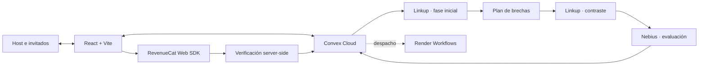

<div align="center">

# Truth Tribunal

### Mucho hype. Que hablen las pruebas.

Un tribunal multijugador para auditar promesas de IA, pitches de startups y afirmaciones virales con votos en tiempo real, investigación web y evaluación trazable.

**[Probar la aplicación](https://brave-lemur-868.convex.site)** · **[Ver estado técnico](docs/IMPLEMENTATION_STATUS.md)** · **[Preparar la demo](docs/obsidian/08_GUION_Y_CHECKLIST_DEL_VIDEO.md)**

React 18 · TypeScript · Convex · Linkup · Nebius · Render · RevenueCat

*Construido para NERDCONF · Burning Token 2026*

</div>

---

## El Producto

Internet permite publicar una promesa extraordinaria en segundos, pero comprobarla exige buscar fuentes, contrastar condiciones y reconocer lo que no se puede demostrar.

**Truth Tribunal transforma esa comprobación en una experiencia colectiva.** Un host presenta una afirmación, comparte una sala y el jurado vota **LEGIT** o **SMOKE**. Después, el sistema investiga en dos fases y emite una evaluación basada en citas, procedencia e incertidumbre visibles.

> **Historia central de la demo:** el jurado vota; las fuentes ponen a prueba el hype.

El voto expresa la intuición del público. La investigación no intenta confirmar esa intuición: aporta evidencia para sostenerla, corregirla o abstenerse cuando las fuentes no alcanzan.

## Cómo Se Vive Un Caso

1. **Presentar el claim.** El host escribe una promesa o utiliza el asistente para convertir una idea ambigua en una afirmación comprobable.
2. **Convocar al jurado.** Comparte el código `HYPE-XXX` o el enlace de la sala; cada invitado elige un apodo.
3. **Votar en vivo.** Convex sincroniza votos, participantes y el Hype-o-Meter entre navegadores sin recargar.
4. **Investigar en dos fases.** Linkup reúne fuentes iniciales y luego formula una búsqueda de contraste a partir de las brechas encontradas.
5. **Evaluar la evidencia.** Nebius relaciona fuentes y claim; cualquier respaldo o contradicción debe incluir una cita verificable en el fragmento original.
6. **Emitir el resultado.** El tribunal muestra veredicto, limitaciones, tokens y latencia disponibles. La evidencia insuficiente es un resultado válido.
7. **Continuar la sesión.** El host puede abrir otro caso sin abandonar la sala ni perder al jurado.

## Diferenciales

| Capacidad | Qué aporta |
|---|---|
| **Multiplayer real** | Sala, votos, etapas y resultados reactivos; creación atómica de sala y claim. |
| **Investigación dependiente** | La segunda búsqueda no está prefijada: responde a lo que faltó en la primera. |
| **Trazabilidad pericial** | URLs, fragmentos, procedencia, incertidumbre y validación literal de citas. |
| **Abstención honesta** | Si falla un proveedor o no existe sustento suficiente, no se inventa una acusación. |
| **Identidad lúdica** | Tacómetro de hype, confetti y audio procedural generado con Web Audio API. |
| **Experiencia bilingüe** | Interfaz completa en español e inglés, con selección persistente. |
| **Profundidad Pro** | Fuentes globales, matriz de riesgo y dossier exportable en PDF o Markdown. |

## Arquitectura



- **Frontend:** React 18, TypeScript, Vite y Tailwind; publicado con Convex Static Hosting.
- **Estado compartido:** Convex sincroniza salas, votos, investigaciones, evidencias y resultados.
- **Investigación:** acciones privadas llaman a Linkup y Nebius sin exponer credenciales al navegador.
- **Resiliencia:** el contrato de Render usa leases, checkpoints e idempotencia persistidos en Convex.
- **Suscripción:** RevenueCat Test Store gestiona la compra sandbox y Convex valida el entitlement desde servidor.

## Estado Comprobable

**Actualización documental: 12 de septiembre de 2026.** “Implementado” significa que existe código; “verificado” exige una prueba registrada. El detalle cronológico y sus límites viven en [`docs/IMPLEMENTATION_STATUS.md`](docs/IMPLEMENTATION_STATUS.md).

| Objetivo | Estado actual | Cierre pendiente para el video |
|---|---|---|
| **Convex · Multiplayer** | Verificado en dos sesiones: creación, unión, votos, investigación, resultado y siguiente caso. Frontend y backend publicados. | Grabar el recorrido final sobre la URL pública. |
| **Linkup · Deep Research** | Dos consultas dependientes implementadas; ejecución real con ambas respuestas HTTP 200 registrada el 08/09. | Mostrar en pantalla una brecha que motive la segunda consulta y abrir una fuente. |
| **Nebius · Applied AI** | Inferencia real registrada con tokens de `usage`, latencia neta y abstención por evidencia insuficiente. | Mostrar una corrida representativa. Costo y confianza siguen como no disponibles si no hay medición sustentada. |
| **Render · Workflows** | SDK, despacho, lease, checkpoints, reintentos e idempotencia implementados y cubiertos por pruebas automatizadas. | El servicio real está bloqueado por configuración/facturación en Render; no afirmar recuperación en vivo hasta ejecutarla. |
| **RevenueCat · Subscriptions** | Bypasses eliminados; catálogo, compra válida y fallos de Test Store comprobados. Validación server-side implementada. | Configurar la clave privada y verificar desbloqueo, restauración, dossier y expiración end-to-end. |
| **NERDCONF · Fun Build** | Votación, tacómetro, confetti y audio procedural implementados; interacción multisesión comprobada. | Capturar una toma clara con reacción del jurado y audio habilitado por gesto. |

Los fallbacks conservan la continuidad de la interfaz, pero están identificados y **no cuentan como evidencia real**. Render y RevenueCat sólo deben aparecer como integraciones cerradas en el video después de completar sus pruebas end-to-end.

## Demo De Dos Minutos

El video debe enseñar una sola historia y hacer visible una prueba por integración. Los detalles de tomas, narración y contingencias están en [`docs/obsidian/08_GUION_Y_CHECKLIST_DEL_VIDEO.md`](docs/obsidian/08_GUION_Y_CHECKLIST_DEL_VIDEO.md).

| Tiempo | Imagen | Mensaje |
|---|---|---|
| **0:00–0:10** | Claim en pantalla y producto abierto. | “Las promesas se publican en segundos; comprobarlas no.” |
| **0:10–0:28** | Host e invitado votan; ambos conteos cambian. | “El jurado decide primero, en tiempo real.” |
| **0:28–0:52** | Fuente inicial, brecha y búsqueda de contraste. | “La segunda búsqueda responde a lo que faltó en la primera.” |
| **0:52–1:12** | Monitor de workflow. | Mostrar fallo y recuperación sólo si el run real de Render fue verificado; de lo contrario, usar este tiempo para trazabilidad. |
| **1:12–1:34** | Resultado, cita, tokens, latencia y limitación. | “Nebius evalúa; el backend exige citas literales y puede abstenerse.” |
| **1:34–1:52** | Test Store y dossier. | Mostrar desbloqueo sólo si el servidor confirmó el entitlement; rotular “Sandbox, sin cobro real”. |
| **1:52–2:00** | Siguiente caso y URL pública. | “Presenta la promesa. Convoca al jurado. Examina las pruebas.” |

**Regla de grabación:** se pueden recortar esperas, pero deben rotularse. No se deben reemplazar ejecuciones pendientes por simulaciones presentadas como reales.

## Ejecutarlo Localmente

Requisitos: Node.js 24, npm y un proyecto Convex configurado.

```powershell
npm install
Copy-Item .env.example .env.local
```

Configura las variables sin subir secretos a Git:

| Variable | Dónde se utiliza |
|---|---|
| `VITE_CONVEX_URL` | Frontend. |
| `CONVEX_DEPLOYMENT` | Convex CLI. |
| `LINKUP_API_KEY` | Backend Convex. |
| `NEBIUS_API_KEY` | Backend Convex. |
| `NEBIUS_MODEL` | Backend Convex; modelo opcional configurable. |
| `VITE_REVENUECAT_PUBLIC_KEY` | RevenueCat Web SDK. |
| `REVENUECAT_SECRET_KEY` | Convex; verificación privada de compras. |
| `RENDER_API_KEY` | Convex; despacho privado del workflow. |
| `RENDER_TASK_SLUG` | Convex; tarea real registrada en Render. |
| `WORKFLOW_SHARED_SECRET` | Convex y Render; autentica callbacks del worker. |

Inicia backend y frontend en terminales separadas:

```powershell
# Terminal 1
npx convex dev
```

```powershell
# Terminal 2
npm run dev
```

### Verificar Y Publicar

```powershell
npm test
npm run build
npm run build:workflow
npx convex dev --once
npm run deploy
```

`npm run deploy` compila y publica el frontend, pero no sustituye el despliegue de las funciones Convex. La prueba opcional `node scripts/verify-research.mjs --live` consume cuota real de Linkup y Nebius.

## Mapa Del Repositorio

```text
src/                     Interfaz React, contexto de idioma y audio procedural
convex/                  Esquema, estado reactivo, investigación y entitlements
convex/lib/              Políticas de evidencia, sesiones y ejecución
workflows/               Worker de Render y manifiesto de infraestructura
tests/                   Pruebas de integración, política y componentes
scripts/                 Verificación reproducible de proveedores
docs/                    Estado técnico y planes de entrega
docs/obsidian/           Bóveda personal para comprender y presentar el proyecto
```

## Documentación

- [`docs/IMPLEMENTATION_STATUS.md`](docs/IMPLEMENTATION_STATUS.md): registro técnico, pruebas ejecutadas y límites.
- [`docs/PROJECT_MEMORY.md`](docs/PROJECT_MEMORY.md): memoria breve para retomar el trabajo.
- [`docs/FINAL_PUSH_PLAN.md`](docs/FINAL_PUSH_PLAN.md): plan de cierre competitivo y bloqueos actuales.
- [`docs/HACKATHON_PLAN.md`](docs/HACKATHON_PLAN.md): requisitos y planificación de entrega.
- [`docs/obsidian/00_INDICE_TRUTH_TRIBUNAL.md`](docs/obsidian/00_INDICE_TRUTH_TRIBUNAL.md): índice de aprendizaje personal compatible con Obsidian.

---

<div align="center">

**Presenta la promesa. Convoca al jurado. Examina las pruebas.**

</div>
