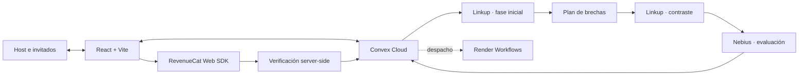

<div align="center">

# Truth Tribunal

### Mucho hype. Que hablen las pruebas.

Un tribunal multijugador para auditar promesas de IA, pitches de startups y afirmaciones virales con votos en tiempo real, investigación web y evaluación trazable.

**[Probar la aplicación](https://brave-lemur-868.convex.site)** · **[Estado técnico](docs/IMPLEMENTATION_STATUS.md)**

React 18 · TypeScript · Convex · Linkup · Nebius · Render · RevenueCat

</div>

---

## El Producto

Internet permite publicar una promesa extraordinaria en segundos, pero comprobarla exige buscar fuentes, contrastar condiciones y reconocer lo que no se puede demostrar.

**Truth Tribunal transforma esa comprobación en una experiencia colectiva.** Un host presenta una afirmación, comparte una sala y el jurado vota **LEGIT** o **SMOKE**. Después, el sistema investiga en dos fases y emite una evaluación basada en citas, procedencia e incertidumbre visibles.

El voto expresa la intuición del público. La investigación no intenta confirmar esa intuición: aporta evidencia para sostenerla, corregirla o abstenerse cuando las fuentes no alcanzan.

## Cómo Se Vive Un Caso

1. **Presentar el claim.** El host escribe una promesa o utiliza el asistente para convertir una idea ambigua en una afirmación comprobable.
2. **Convocar al jurado.** Comparte el código `HYPE-XXXXXX` o el enlace de la sala; cada invitado elige un apodo.
3. **Votar en vivo.** Convex sincroniza votos, participantes y el Hype-o-Meter entre navegadores sin recargar.
4. **Investigar en dos fases.** Linkup reúne fuentes iniciales y luego formula una búsqueda de contraste a partir de las brechas encontradas.
5. **Evaluar la evidencia.** Nebius relaciona fuentes y claim; cualquier respaldo o contradicción debe incluir una cita verificable en el fragmento original.
6. **Emitir el resultado.** El tribunal muestra veredicto, limitaciones, tokens y latencia disponibles. La evidencia insuficiente es un resultado válido.
7. **Continuar la sesión.** El host puede abrir otro caso sin abandonar la sala ni perder al jurado.

## Diferenciales

| Capacidad | Qué aporta |
|---|---|
| **Multiplayer real** | Sala, votos, etapas y resultados reactivos; creación atómica de sala y claim. |
| **Investigación dependiente** | La segunda búsqueda no está prefijada: responde a lo que faltó en la primera. |
| **Trazabilidad pericial** | URLs, fragmentos, procedencia, incertidumbre y validación literal de citas. |
| **Abstención honesta** | Si falla un proveedor o no existe sustento suficiente, no se inventa una acusación. |
| **Identidad lúdica** | Tacómetro de hype, confetti y audio procedural generado con Web Audio API. |
| **Experiencia bilingüe** | Interfaz completa en español e inglés, con selección persistente. |
| **Profundidad Pro** | Fuentes globales, matriz de riesgo y dossier exportable en PDF o Markdown. |

## Integraciones Aplicadas

El proyecto integra los siguientes servicios, cada uno con un rol definido en la arquitectura:

| Servicio | Rol en Truth Tribunal |
|---|---|
| **Convex** | Backend serverless y estado reactivo en tiempo real. Sincroniza salas, votos, investigaciones y resultados entre todos los participantes vía WebSocket. Hosting estático del frontend en `convex.site`. |
| **Linkup** | Investigación web profunda en dos fases iterativas. Fase 1 recopila fuentes y benchmarks; Fase 2 busca contradicciones y brechas basándose en los hallazgos guardados de Fase 1. |
| **Nebius** | Inferencia pericial con Token Factory (API OpenAI-compatible). Evalúa el claim contra la evidencia recopilada, exigiendo citas textuales trazables para emitir cualquier veredicto acusatorio. |
| **Render** | Orquestación de background workers con tolerancia a fallos. Ejecuta la auditoría con checkpoints persistentes, leases y reintentos idempotentes. Incluye fallback transparente a Convex si Render no está disponible. |
| **RevenueCat** | Suscripciones web en Test Store (sandbox). Gestiona el entitlement `pro_auditor_access` con verificación server-side. El nivel Pro desbloquea fuentes globales, matriz de riesgo y dossier exportable. |
| **Web Audio API** | Sintetizador procedural de efectos de tribunal (martillazo de juez, sirena de humo, acordes de veredicto). Cero archivos de audio externos; todo generado matemáticamente con osciladores y filtros. |

## Arquitectura



- **Frontend:** React 18, TypeScript, Vite y Tailwind; publicado con Convex Static Hosting.
- **Estado compartido:** Convex sincroniza salas, votos, investigaciones, evidencias y resultados.
- **Investigación:** acciones privadas llaman a Linkup y Nebius sin exponer credenciales al navegador.
- **Resiliencia:** el contrato de Render usa leases, checkpoints e idempotencia persistidos en Convex.
- **Suscripción:** RevenueCat Test Store gestiona la compra sandbox y Convex valida el entitlement desde servidor.

## Ejecutarlo Localmente

Requisitos: Node.js 20+, npm y un proyecto Convex configurado.

```powershell
npm install
Copy-Item .env.example .env.local
```

Configura las variables sin subir secretos a Git:

| Variable | Dónde se utiliza |
|---|---|
| `VITE_CONVEX_URL` | Frontend. |
| `CONVEX_DEPLOYMENT` | Convex CLI. |
| `LINKUP_API_KEY` | Backend Convex. |
| `NEBIUS_API_KEY` | Backend Convex. |
| `NEBIUS_MODEL` | Backend Convex; modelo opcional configurable. |
| `VITE_REVENUECAT_PUBLIC_KEY` | RevenueCat Web SDK. |
| `REVENUECAT_SECRET_KEY` | Convex; verificación privada de compras. |
| `RENDER_API_KEY` | Convex; despacho privado del workflow. |
| `RENDER_TASK_SLUG` | Convex; tarea real registrada en Render. |
| `WORKFLOW_SHARED_SECRET` | Convex y Render; autentica callbacks del worker. |

Inicia backend y frontend en terminales separadas:

```powershell
# Terminal 1
npx convex dev
```

```powershell
# Terminal 2
npm run dev
```

### Verificar Y Publicar

```powershell
npm test
npm run build
npm run build:workflow
npx convex dev --once
npm run deploy
```

`npm run deploy` compila y publica el frontend, pero no sustituye el despliegue de las funciones Convex. La prueba opcional `node scripts/verify-research.mjs --live` consume cuota real de Linkup y Nebius.

## Mapa Del Repositorio

```text
src/                     Interfaz React, contexto de idioma y audio procedural
convex/                  Esquema, estado reactivo, investigación y entitlements
convex/lib/              Políticas de evidencia, sesiones y ejecución
workflows/               Worker de Render y manifiesto de infraestructura
tests/                   Pruebas de integración, política y componentes
scripts/                 Verificación reproducible de proveedores
docs/                    Estado técnico y planes de entrega
```

## Documentación Técnica

- [`docs/IMPLEMENTATION_STATUS.md`](docs/IMPLEMENTATION_STATUS.md): registro técnico, pruebas ejecutadas y límites.
- [`docs/PROJECT_MEMORY.md`](docs/PROJECT_MEMORY.md): memoria breve para retomar el trabajo.

---

<div align="center">

**Presenta la promesa. Convoca al jurado. Examina las pruebas.**

</div>
