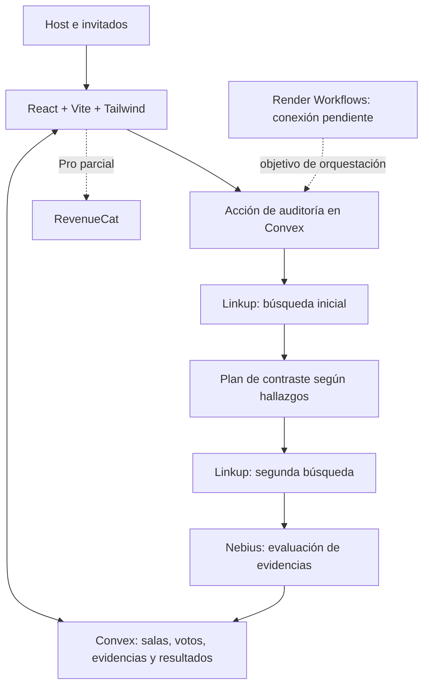

<div align="center">

# ⚖️ Truth Tribunal

### Mucho hype. Que hablen las pruebas.

Un tribunal multijugador para poner a prueba promesas de IA, pitches de startups y afirmaciones virales.

**[Abrir el tribunal](https://brave-lemur-868.convex.site)** · **[Estado técnico](docs/IMPLEMENTATION_STATUS.md)** · **[Plan de entrega](docs/HACKATHON_PLAN.md)**

React 18 · TypeScript · Convex · Linkup · Nebius

*Creado para NERDCONF — Burning Token 2026*

</div>

---

## 💡 La idea

Internet está lleno de promesas extraordinarias: una IA que reemplaza equipos enteros, un producto que supera todos los benchmarks o una startup que asegura haber resuelto lo imposible. Compartirlas toma segundos; comprobarlas exige trabajo.

**Truth Tribunal convierte esa comprobación en una experiencia colectiva.** Alguien presenta una afirmación, invita a una sala y el público vota: **LEGIT** o **SMOKE**. Después, el sistema busca fuentes, investiga lo que falta y produce una evaluación con evidencias y limitaciones visibles.

La tensión está en descubrir si la intuición del jurado coincide con lo que sostienen las fuentes. El voto representa opinión; la investigación aporta argumentos para revisarla.

> **Ejemplo ilustrativo:** «Nuestra IA reemplaza a diez desarrolladores y reduce los costos un 90 %».
> El tribunal busca qué se midió, frente a qué alternativa, bajo qué condiciones y si existen pruebas independientes. El resultado depende de lo encontrado; también puede ser **evidencia insuficiente**.

## 🎮 Así se vive un caso

1. **Abre la sala.** Presenta un claim propio o usa un ejemplo. El asistente ayuda a convertir ideas ambiguas en preguntas comprobables.
2. **Convoca al jurado.** Comparte el código `HYPE-XXX` o el enlace de la sala. Los invitados eligen un apodo.
3. **Vota y mira el pulso colectivo.** Los votos alimentan un Hype-o-Meter animado, con sonidos procedurales y actividad compartida.
4. **Lanza la investigación.** Una primera búsqueda reúne hallazgos; una segunda consulta se construye a partir de las brechas detectadas y busca contraste.
5. **Examina el resultado.** Consulta fuentes, fragmentos, incertidumbre y métricas disponibles. Si no hay sustento suficiente, el tribunal lo indica y ofrece reformular el claim.
6. **Abre otro caso.** El host puede continuar en la misma sala, conservando la dinámica del grupo.

## ✨ Qué construimos

| Experiencia | Qué aporta |
|---|---|
| **Tribunal en tiempo real** | Salas, votos y resultados reactivos con Convex; creación atómica de sala y claim. |
| **Investigación en dos fases** | Linkup reúne fuentes y ejecuta un seguimiento derivado de los hallazgos iniciales. |
| **Evaluación con trazabilidad** | Nebius recibe el claim y las evidencias; las relaciones de respaldo o contradicción requieren fragmentos trazables. |
| **Asistente de formulación** | Sugiere afirmaciones empíricas cuando la pregunta es ambigua o la auditoría queda sin evidencia suficiente. |
| **Una sala que continúa** | Nuevos casos sin crear otra sala, apodos para invitados y audio de veredicto vinculado al estado compartido. |
| **Personalidad de tribunal** | Martillazo, sirena, sonidos de voto, confetti y tacómetro de hype; audio generado con Web Audio, sin archivos de sonido externos. |
| **Pro en demostración** | Paywall, mayor límite de resultados por fase y exportación Markdown del dossier. La compra y el contenido pericial tienen limitaciones descritas abajo. |

El producto puede servir para debatir noticias tecnológicas, contrastar pitches y practicar lectura crítica de promesas comerciales. La línea Pro explora informes de due diligence para equipos de inversión; hoy sigue siendo un prototipo.

## 🔎 Estado real del proyecto

**Revisión documental: 11 de septiembre de 2026.** El registro conserva pruebas locales, una ejecución real de Linkup/Nebius y despliegues anteriores. Esto no certifica todos los recorridos actuales en producción.

| Reto objetivo | Implementación y evidencia disponible | Qué falta cerrar |
|---|---|---|
| **Convex · Multiplayer** | Estado reactivo y static hosting; frontend y backend publicados el 11 de septiembre. | Recorrido completo Host/Invitado comprobado el 11/09; falta grabación final para entrega. |
| **Linkup · Deep Research** | Dos consultas dependientes; ejecución real registrada el 8 de septiembre con persistencia en memoria durante la prueba. | Demostrar el recorrido actual completo en el sitio publicado. |
| **Nebius · Applied AI** | Inferencia real registrada, tokens de `usage`, latencia de la petición y un caso de evidencia insuficiente documentado. | Evaluación representativa; costo y confianza siguen sin medición disponible. |
| **Render · Workflows** | Prototipo de worker y mecanismos parciales de checkpoints/deduplicación en Convex. | Conectar Render Workflows y demostrar recuperación sin duplicados. El flujo actual llama directamente a una acción de Convex. |
| **RevenueCat · Subscriptions** | SDK, paywall y descarga `.md` presentes. | Compra Test Store y entitlement comprobados en backend. El flujo actual puede conceder Pro sin compra válida; el dossier usa riesgos prefijados. |
| **NERDCONF · Fun Build** | Audio procedural, votación y tacómetro; comprobaciones interactivas anteriores registradas. | Recorrido multisesión grabado y prueba con alguien externo. |

**Principio del tribunal:** una simulación no cuenta como evidencia. El flujo de investigación identifica fallbacks y puede abstenerse; las pantallas Pro aún contienen textos de verificación y riesgos fijos que no deben interpretarse como una compra comprobada ni como conclusiones del caso.

Consulta [el registro de implementación](docs/IMPLEMENTATION_STATUS.md) para conocer el alcance de cada comprobación y sus pendientes.

## 🏗️ Cómo funciona por dentro



El frontend se publica en Convex Static Hosting. Convex conserva el estado compartido; las llamadas a Linkup y Nebius se ejecutan en el backend. Render y la verificación de suscripciones son los siguientes cierres de integración.

```text
src/components/       Salas, votación, evidencias, veredicto y paywall
src/hooks/            Audio procedural e integración del SDK RevenueCat
convex/               Datos, mutaciones y acciones de investigación
convex/lib/           Política de evaluación, contraste y sugerencias
workflows/            Prototipo del worker y manifiesto de Render
tests/                Pruebas de política, investigación y componentes
scripts/              Comprobación reproducible de proveedores
docs/                 Estado técnico, evidencias y plan del hackathon
```

## 🚀 Ejecutarlo localmente

Usa **Node.js 24** para reproducir la suite de pruebas del proyecto, npm y un proyecto Convex con acceso configurado.

```powershell
npm install
Copy-Item .env.example .env.local
```

Completa `.env.local` con tus valores. Conserva el archivo fuera de Git.

| Variable | Uso |
|---|---|
| `VITE_CONVEX_URL` | URL pública del backend para el frontend. |
| `CONVEX_DEPLOYMENT` | Deployment seleccionado por Convex CLI; se configura al vincular el proyecto. |
| `LINKUP_API_KEY` | Credencial privada para búsquedas en el backend. |
| `NEBIUS_API_KEY` | Credencial privada de inferencia en el backend. |
| `NEBIUS_MODEL` | Modelo configurable; valor de referencia en `.env.example`. |
| `VITE_REVENUECAT_PUBLIC_KEY` | Clave pública del Web SDK para el entorno de prueba. |

Configura también `LINKUP_API_KEY`, `NEBIUS_API_KEY` y, si corresponde, `NEBIUS_MODEL` en las variables del backend de Convex. Las variables locales no se transfieren automáticamente a Cloud. Sólo las claves públicas deben usar el prefijo `VITE_`.

Inicia Convex y Vite en terminales separadas:

```powershell
# Terminal 1
npx convex dev
```

```powershell
# Terminal 2
npm run dev
```

### Comprobar y publicar

```powershell
npm test
npm run build
npx convex dev --once
```

El último comando valida y despliega el backend en el deployment configurado. Verifica el destino antes de ejecutarlo.

Para compilar y publicar el frontend en Convex Static Hosting:

```powershell
npm run deploy
```

**`npm run deploy` sólo compila y publica el frontend; no despliega las funciones del backend.** Coordina ambas publicaciones cuando haya cambios de contrato.

La comprobación opcional `node scripts/verify-research.mjs --live` llama a Linkup y Nebius reales y consume cuota. Su alcance y reportes están en el registro técnico.

## 🎬 Demo de dos minutos

Guion propuesto: grabar los resultados observados, identificar esperas editadas y presentar las integraciones pendientes como tales. No hay un veredicto prefijado para el video.

| Tiempo | Qué mostrar |
|---|---|
| **0:00–0:15** | La promesa a investigar y la idea: «El público vota. Las fuentes ponen a prueba el hype». |
| **0:15–0:35** | Host e invitado en paralelo: entrar, elegir apodo y votar; observar el medidor y escuchar el tribunal. |
| **0:35–1:00** | Primera búsqueda y consulta de contraste: explicar qué hallazgo motivó la segunda fase y abrir una fuente. |
| **1:00–1:25** | Resultado de Nebius, tokens y latencia disponibles; explicar una limitación concreta y reformular si falta evidencia. |
| **1:25–1:40** | Recuperación de Render sólo si está conectada y comprobada; en caso contrario, explicar su estado pendiente y mostrar la continuidad de sala. |
| **1:40–1:55** | Compra sandbox sólo si está verificada; mientras tanto, identificar Pro y la exportación como demostración. |
| **1:55–2:00** | Invitación a probar el tribunal y URL pública. |

El [plan de entrega](docs/HACKATHON_PLAN.md) conserva las indicaciones consultadas sobre publicación en X, etiqueta `@nerdconf_ar`, formulario y discrepancia de fechas.

## 🧭 Próximos pasos

- **Cerrar la demo:** prueba multisesión, evaluación con claims sustentados/contradichos/ambiguos y video del recorrido real.
- **Completar integraciones:** Render Workflows con recuperación observable; RevenueCat con verificación de acceso y dossier sustentado en evidencias del caso.
- **Explorar después del hackathon:** extensión para redes sociales, bot, auditoría de pitch decks y debate entre agentes. Son propuestas futuras.

La memoria de continuidad está en [docs/PROJECT_MEMORY.md](docs/PROJECT_MEMORY.md); las reglas técnicas, en [AGENTS.md](AGENTS.md).

---

<div align="center">

**⚖️ Presenta la promesa. Convoca al jurado. Examina las pruebas.**

</div>
