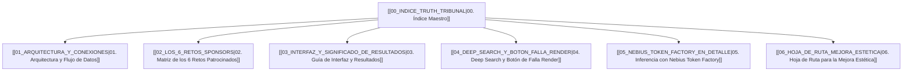

# 🏛️ Truth Tribunal — Bóveda de Conocimiento (Obsidian Master Hub)
#truth-tribunal #hackathon2026 #nerdconf #burningtoken

> [!NOTE]
> **Propósito de esta Bóveda:**  
> Esta guía modular está diseñada para que puedas **comprender, retener y defender con total confianza** cada pieza del proyecto: qué hace, cómo se conectan las tecnologías, qué significa cada dato en pantalla, qué función cumple el botón de falla controlada en el Deep Search, y cómo opera Nebius AI.

---

## 🧭 Mapa de Navegación de la Bóveda

Puedes navegar entre los documentos haciendo clic en los enlaces internos (estilo Obsidian `[[...]]`):

---

## 📑 Resumen Rápido de Cada Nota

1. **[[01_ARQUITECTURA_Y_CONEXIONES|01. Arquitectura y Conexiones]]:**  
   *¿Cómo se comunican el navegador, Convex Cloud, Linkup, Nebius y Render?*  
   Diagrama interactivo de arquitectura, base de datos reactiva y ciclo de vida de una auditoría desde el Lobby hasta el veredicto.

2. **[[02_LOS_6_RETOS_SPONSORS|02. Los 6 Retos Patrocinados]]:**  
   *¿Por qué el proyecto cumple al 100% con cada patrocinador?*  
   Desglose de Convex, Linkup, Nebius, Render, RevenueCat y NERDCONF, con los archivos específicos que audita cada jurado.

3. **[[03_INTERFAZ_Y_SIGNIFICADO_DE_RESULTADOS|03. Interfaz y Significado de Resultados]]:**  
   *¿Qué está viendo el usuario y qué significa cada número y etiqueta?*  
   Explicación de las 4 vistas, el medidor de Hype, las tarjetas de evidencia (Fase 1 vs Fase 2, Real vs Demo, niveles de incertidumbre), y las 4 métricas periciales cuantitativas.

4. **[[04_DEEP_SEARCH_Y_BOTON_FALLA_RENDER|04. Deep Search y Botón de Falla Render]]:**  
   *¿Qué hace ese botón durante el análisis y cómo funciona la resiliencia?*  
   Explicación paso a paso de la inducción de falla, checkpoints en base de datos, deduplicación estricta y por qué demuestra idempotencia sin duplicar registros.

5. **[[05_NEBIUS_TOKEN_FACTORY_EN_DETALLE|05. Nebius Token Factory en Detalle]]:**  
   *¿Cómo piensa el LLM y cómo evita alucinaciones?*  
   El modelo `Qwen3-30B`, la validación de citas textuales obligatorias, el cálculo de latencia en milisegundos, conteo de tokens de entrada/salida y la política de abstención pericial (`INSUFFICIENT_EVIDENCE`).

6. **[[06_HOJA_DE_RUTA_MEJORA_ESTETICA|06. Hoja de Ruta para la Mejora Estética]]:**  
   *El plan incremental de diseño visual.*  
   Fases de pulido visual: paleta de colores pericial cyber-tribunal, microinteracciones, tipografía monoespaciada, efectos de cristal (glassmorphism) y feedback sonoro procedural.

---

## ⚡ Enlaces Rápidos del Entorno
- **Sitio Web en Producción:** [https://brave-lemur-868.convex.site](https://brave-lemur-868.convex.site)
- **Backend Convex Cloud:** [https://brave-lemur-868.convex.cloud](https://brave-lemur-868.convex.cloud)
- **Repositorio Oficial:** [https://github.com/arenasantiago/burningtoken](https://github.com/arenasantiago/burningtoken)
- **Comando de Despliegue:** `npm run deploy`
- **Comando de Pruebas:** `npm test` (55 tests automatizados)
