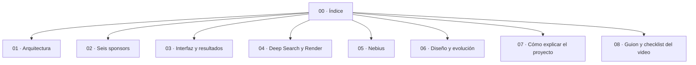

---
aliases:
  - Truth Tribunal Hub
tags:
  - truth-tribunal
  - burning-token
  - proyecto
updated: 2026-09-12
---

# Truth Tribunal · Bóveda Personal

> [!NOTE] Propósito
> Esta carpeta es mi manual personal para comprender, explicar y defender el proyecto. No reemplaza el registro técnico del repositorio. Cuando una nota y el código discrepen, prevalecen el código y `docs/IMPLEMENTATION_STATUS.md`.

## Idea En Una Frase

**Truth Tribunal convierte una promesa exagerada en un juicio colectivo: el público vota y una investigación trazable pone a prueba el hype.**

## Mapa De Aprendizaje



## Orden Recomendado

1. [[07_COMO_EXPLICAR_EL_PROYECTO|Cómo explicar el proyecto]]: versión corta para conversación, pitch o jurado.
2. [[01_ARQUITECTURA_Y_CONEXIONES|Arquitectura y conexiones]]: recorrido técnico de extremo a extremo.
3. [[02_LOS_6_RETOS_SPONSORS|Los seis retos sponsors]]: requisito, código, evidencia y pendiente de cada sponsor.
4. [[03_INTERFAZ_Y_SIGNIFICADO_DE_RESULTADOS|Interfaz y significado de resultados]]: qué representa cada pantalla y métrica.
5. [[04_DEEP_SEARCH_Y_BOTON_FALLA_RENDER|Deep Search y falla controlada]]: investigación, checkpoints e idempotencia.
6. [[05_NEBIUS_TOKEN_FACTORY_EN_DETALLE|Nebius Token Factory]]: inferencia, citas, tokens, latencia y límites.
7. [[06_HOJA_DE_RUTA_MEJORA_ESTETICA|Diseño y evolución visual]]: decisiones ya materializadas y mejoras futuras.
8. [[08_GUION_Y_CHECKLIST_DEL_VIDEO|Guion y checklist del video]]: preparación de la grabación final.

## Semáforo De Verdad

Usar estas palabras de manera estricta al estudiar o presentar:

| Estado | Significado |
|---|---|
| **Implementado** | Hay código para la capacidad, pero puede no haberse probado con el servicio real. |
| **Verificado** | Existe una comprobación fechada, con entorno, alcance y resultado. |
| **Simulado** | La UI o un fallback representa la operación con datos no obtenidos del proveedor. |
| **Planeado** | Todavía no existe la capacidad completa. |

> [!WARNING] Regla para el jurado
> No decir “cumplimos al 100 %” por tener archivos o pantallas. Render necesita una ejecución real del workflow; RevenueCat necesita validar el entitlement end-to-end desde servidor.

## Estado Mental Rápido

- **Convex:** recorrido multisesión y publicación comprobados.
- **Linkup:** dos búsquedas dependientes y una ejecución real registradas.
- **Nebius:** inferencia real, tokens, latencia y abstención registradas; costo/confianza no deben inventarse.
- **Render:** arquitectura y pruebas automatizadas listas; ejecución real bloqueada por configuración/facturación.
- **RevenueCat:** compra Test Store y casos negativos observados; falta cerrar validación server-side end-to-end.
- **Fun Build:** audio procedural, votos, tacómetro y confetti implementados.

## Enlaces Operativos

- [Aplicación pública](https://brave-lemur-868.convex.site)
- [Repositorio](https://github.com/arenasantiago/burningtoken)
- [Estado técnico](../IMPLEMENTATION_STATUS.md)
- [Plan de cierre](../FINAL_PUSH_PLAN.md)
- [Memoria del proyecto](../PROJECT_MEMORY.md)

## Comandos Que Debo Recordar

```powershell
npm test
npm run build
npm run build:workflow
npx convex dev --once
npm run deploy
```

`npm run deploy` publica el frontend. `npx convex dev --once` valida y despliega las funciones del backend seleccionado.
