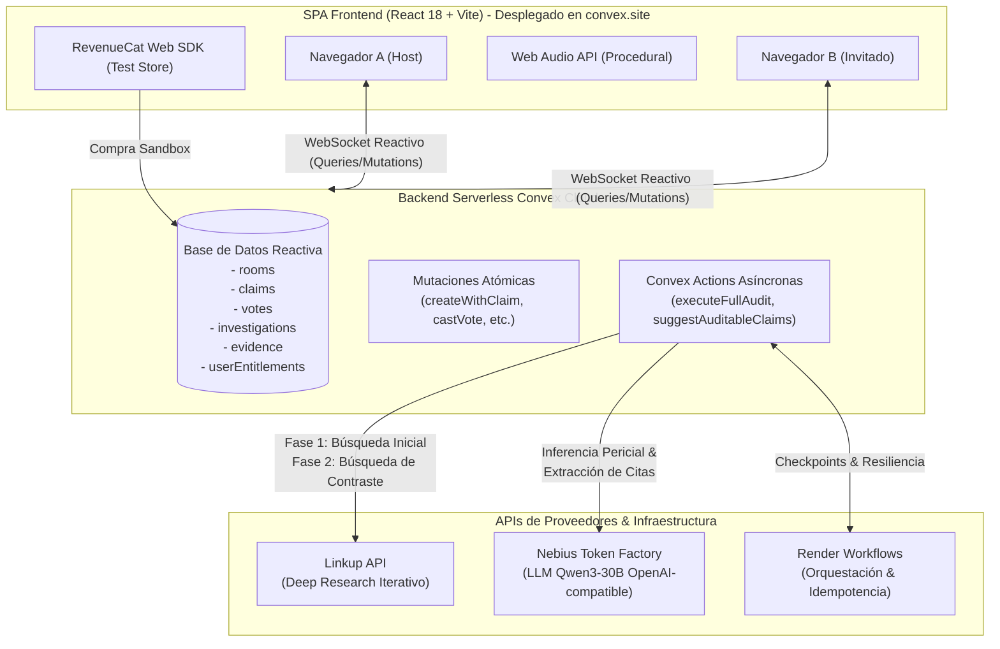

# 🏗️ 01. Arquitectura del Sistema y Flujo de Datos
#arquitectura #convex #linkup #nebius #render #revenuecat

Regresar al [[00_INDICE_TRUTH_TRIBUNAL|Índice Maestro]].

---

## 🧭 Visión General de la Arquitectura

**Truth Tribunal** es una aplicación web multijugador en tiempo real (SPA) donde **el estado no se refresca manualmente**: cada cambio en la base de datos se refleja instantáneamente en todos los navegadores conectados gracias a la reactividad de **Convex**.

---

## 🔄 El Ciclo de Vida de una Auditoría Paso a Paso

### Paso 1: Creación Atómica de Sala y Claim
1. El Host entra en la aplicación (`src/components/RoomLobby.tsx`).
2. Puede escribir una afirmación o usar el **Asistente Pericial de Prompts** (`✨ Optimizar con Asistente Pericial`) para convertir una idea vaga en una hipótesis contrastable.
3. Al hacer clic en *"Abrir Sala e Iniciar Juicio"*, se dispara la mutación atómica `createWithClaim` en [`convex/rooms.ts`](file:///c:/Users/Santiago%20Arenas/Desktop/Burning%20dev/convex/rooms.ts):
   * Inserta la sala con su código normalizado (ej: `HYPE-404`).
   * Inserta el claim asociado.
   * Vincula `activeClaimId` a la sala en una sola transacción.
   * **Invariante:** Nunca queda un invitado esperando con claim indefinido.

### Paso 2: Votación Multijugador en Vivo (Convex Multiplayer)
1. El Host comparte la URL con el código (`?room=HYPE-404`).
2. Cualquier invitado abre el enlace en otra pestaña o ventana de incógnito (`src/components/LiveVoting.tsx`).
3. Ambos votan en tiempo real:
   * **`SMOKE` (Puro Humo):** Consideran que es una exageración publicitaria.
   * **`LEGIT` (Verídico):** Creen que la promesa tiene sustento técnico.
4. Convex actualiza el conteo de votos instantáneamente vía suscripción reactiva (`api.votes.getCounts`), moviendo las barras de porcentaje y el **Hype-o-Meter** sin recargar la página.

### Paso 3: Disparo de la Auditoría Autónoma
1. El Host presiona *"Desplegar Auditoría Autónoma"*.
2. La mutación `startOrGet` en [`convex/investigations.ts`](file:///c:/Users/Santiago%20Arenas/Desktop/Burning%20dev/convex/investigations.ts) crea el registro de investigación con un `workflowRunId` único y cambia el estado de la sala a `"auditing"`.
3. Se invoca la acción `executeFullAudit` en [`convex/actions.ts`](file:///c:/Users/Santiago%20Arenas/Desktop/Burning%20dev/convex/actions.ts).

### Paso 4: Deep Research con Linkup (Dos Fases)
1. **Fase 1 (Búsqueda Inicial):** Consulta a Linkup para encontrar fuentes primarias y benchmarks.
   * Se normalizan y limpian las URLs.
   * Se insertan en la tabla `evidence` de Convex con deduplicación automática.
   * Se guarda el checkpoint `linkup_initial_search_done`.
2. **Fase 2 (Contraste y Detección de Brechas):**
   * El algoritmo `buildContrastPlan` analiza los hallazgos de la Fase 1 e identifica qué falta por verificar (brechas de cobertura).
   * Se excluyen los dominios web ya visitados.
   * Se ejecuta una segunda búsqueda en Linkup con los términos de contraste y contradicciones.
   * Se almacenan las evidencias de contraste.

### Paso 5: Síntesis Pericial con Nebius Token Factory
1. Se compilan los textos y fragmentos encontrados.
2. Se envía una petición HTTP a **Nebius Token Factory** (`https://api.studio.nebius.ai/v1/chat/completions`) usando el modelo `Qwen/Qwen3-30B-A3B-Instruct-2507`.
3. El LLM devuelve:
   * Veredicto pericial (`VERIFIED_LEGIT`, `PLAUSIBLE`, `CERTIFIED_SMOKE`, o `INSUFFICIENT_EVIDENCE`).
   * Porcentaje de Hype (0 a 100%).
   * Citas textuales obligatorias extraídas de las fuentes para sustentar su decisión.
   * Caso límite documentado (*Edge Case*).
4. El backend extrae el objeto `usage` (tokens de entrada y salida) y calcula la latencia neta de inferencia en milisegundos.

### Paso 6: Emisión del Veredicto y Sonido Procedural
1. Convex guarda el veredicto en `investigations.saveVerdict` y cambia el estado de la sala a `"verdict"`.
2. Todos los navegadores conectados reciben la notificación reactiva simultáneamente:
   * Si es `CERTIFIED_SMOKE`, suena la sirena antismoke y caen alertas rojas.
   * Si es `VERIFIED_LEGIT` o `PLAUSIBLE`, suena el acorde armónico y explotan partículas de confetti (`canvas-confetti`).
3. Se renderiza el panel con las 4 métricas periciales en vivo y el bloque Pro de RevenueCat.

---

## 🗄️ Esquema de Base de Datos en Convex (`convex/schema.ts`)

| Tabla | Propósito Principal | Índices Clave |
|---|---|---|
| `rooms` | Almacena las salas multijugador, código (`HYPE-XXX`), estado y host. | `by_code` |
| `claims` | Texto de la afirmación sometida a juicio, autor y URL de origen. | `by_room` |
| `votes` | Votos individuales (`LEGIT` vs `SMOKE`) con ID de votante para evitar duplicados. | `by_claim`, `by_claim_voter` |
| `investigations` | Estado del workflow, checkpoints de Render, veredicto final y métricas de Nebius. | `by_claim` |
| `evidence` | Hallazgos recolectados por Linkup (Fase 1 y 2), URLs, citas y nivel de incertidumbre. | `by_investigation` |
| `userEntitlements` | Estado Pro verificado por RevenueCat Web SDK (`pro_auditor_access`). | `by_user` |

---

> [!TIP]
> **Siguiente Lectura Recomendada:**  
> Pasa a [[02_LOS_6_RETOS_SPONSORS|02. Los 6 Retos Patrocinados]] para entender en detalle cómo se cumple cada uno de los requisitos de los premios del hackathon.
