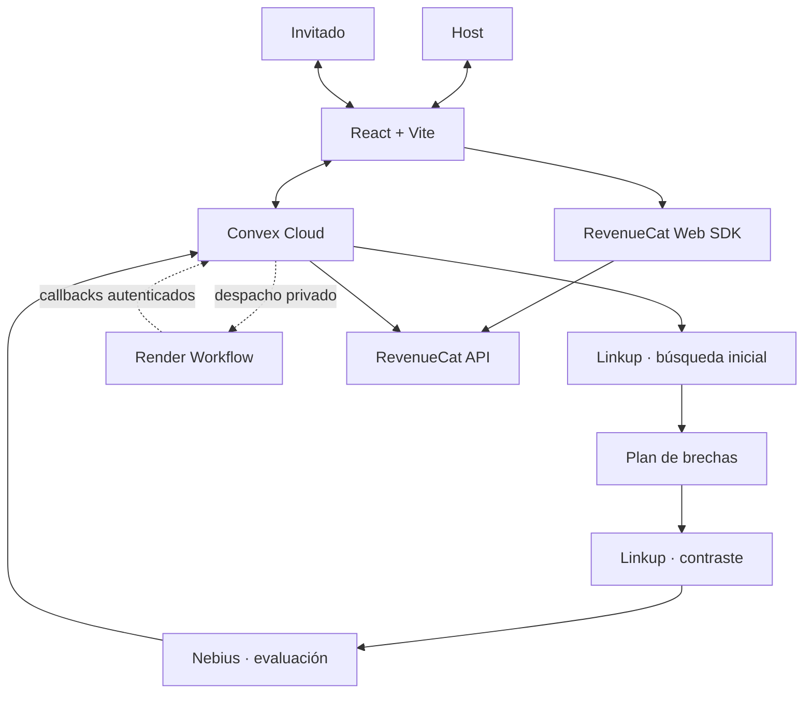

---
tags:
  - arquitectura
  - convex
  - linkup
  - nebius
  - render
  - revenuecat
updated: 2026-09-12
---

# 01 · Arquitectura Y Conexiones

Volver a [[00_INDICE_TRUTH_TRIBUNAL|Índice]].

## Modelo Mental

Truth Tribunal tiene tres capas:

1. **Experiencia:** React presenta salas, votos, investigación, fuentes y resultado.
2. **Estado y reglas:** Convex conserva la verdad compartida y protege las operaciones sensibles.
3. **Proveedores:** Linkup busca, Nebius evalúa, Render orquesta trabajo y RevenueCat acredita acceso Pro.

## Responsabilidad De Cada Pieza

| Componente | Responsabilidad | No debe hacer |
|---|---|---|
| React | Capturar acciones y representar estado reactivo. | Decidir por sí solo permisos, Pro o resultado final. |
| Convex | Persistir datos, autorizar host, sincronizar clientes y ejecutar acciones privadas. | Exponer secretos al navegador. |
| Linkup | Recuperar fuentes web en dos consultas. | Emitir el veredicto. |
| Nebius | Relacionar claim y fuentes en una salida estructurada. | Convertir una cita inventada en evidencia. |
| Render | Ejecutar el workflow fuera del ciclo de vida del navegador. | Usar memoria local como única fuente de checkpoints. |
| RevenueCat | Gestionar compra sandbox y entitlement. | Conceder Pro por una respuesta sólo del cliente. |

## Recorrido De Una Auditoría

### 1. Sala Y Claim Atómicos

`convex/rooms.ts` crea la sala y el claim en una misma mutación. Esto evita que un invitado vea una sala válida sin `activeClaimId`.

### 2. Identidad Y Autorización

- La sesión ligera distingue participantes y votos.
- El host recibe un token aleatorio almacenado en `sessionStorage`.
- Convex guarda/verifica su hash para acciones exclusivas del host.
- Conocer el `hostUserId` público no permite controlar la sala.

### 3. Multiplayer Reactivo

Los dos navegadores se suscriben a queries de Convex. Un voto cambia la base de datos y Convex envía el nuevo estado a todos los clientes conectados, sin polling manual ni recarga.

### 4. Inicio De Investigación

`convex/investigations.ts` crea o reutiliza una investigación para el claim. La UI cambia a auditoría a partir del estado compartido, no de una animación aislada.

### 5. Búsqueda En Dos Fases

- Fase inicial: Linkup obtiene fuentes, URLs y fragmentos.
- Plan de brechas: `convex/lib/research.ts` identifica cobertura faltante y dominios ya utilizados.
- Fase de contraste: se genera otra consulta y se excluyen duplicados.

### 6. Evaluación Nebius

Nebius recibe el claim y las evidencias. `convex/lib/auditPolicy.ts` valida estructura y `convex/lib/research.ts` verifica que las citas atribuidas existan en los fragmentos recibidos.

### 7. Persistencia Y Resultado

Convex guarda evidencias, métricas y veredicto. Todos los participantes reciben el resultado y el audio se dispara con base en la transición reactiva compartida.

### 8. Acceso Pro

El Web SDK inicia la compra Test Store. Convex consulta RevenueCat con una clave privada y sólo persiste Pro si coinciden entorno sandbox, producto, entitlement y vigencia.

## Tablas Principales

| Tabla | Qué representa |
|---|---|
| `rooms` | Sala, código, etapa, host y claim activo. |
| `claims` | Afirmaciones presentadas dentro de una sala. |
| `votes` | Voto por claim y participante. |
| `investigations` | Progreso, lease, checkpoints, run y resultado. |
| `evidence` | Fuentes iniciales y de contraste con procedencia. |
| `userEntitlements` | Acceso Pro, entorno, producto, vigencia y verificación. |

Consultar `convex/schema.ts` para el contrato vigente; esta tabla es una explicación, no el esquema formal.

## Estado Real De Las Conexiones

| Conexión | Estado al 12/09 |
|---|---|
| Navegadores ↔ Convex | Verificada en recorrido Host/Invitado. |
| Convex → Linkup → Nebius | Verificada con proveedores reales el 08/09. |
| Convex ↔ Render | Implementada y probada con dobles; ejecución en Render pendiente. |
| Web SDK ↔ RevenueCat | Compra válida, cancelación y fallo observados. |
| Convex ↔ RevenueCat API | Implementada; falta clave privada y prueba end-to-end. |

Siguiente: [[02_LOS_6_RETOS_SPONSORS|Los seis retos sponsors]].
