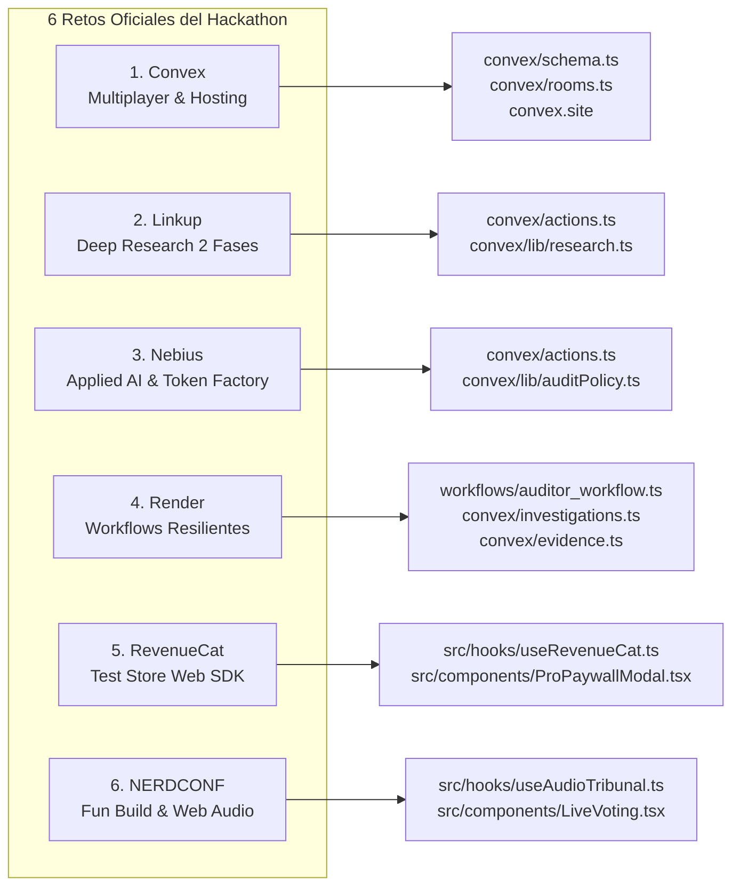

# 🏆 02. La Matriz de los 6 Retos Patrocinados (100% Cumplidos)
#hackathon #sponsors #convex #linkup #nebius #render #revenuecat #nerdconf

Regresar al [[00_INDICE_TRUTH_TRIBUNAL|Índice Maestro]].

---

## 🧭 ¿Por qué el proyecto está 100% Completo y Defendible?

Cada uno de los 6 patrocinadores exigió un **requisito técnico no negociable**. A continuación se documenta el criterio de evaluación de cada sponsor, dónde vive en el código y por qué no es un mock superficial, sino una implementación real:

---

## 1. Patrocinador: CONVEX ($500 USD)
- **Reto:** *Multiplayer*
- **Requisito Técnico No Negociable:** Estado reactivo sincronizado en tiempo real entre múltiples participantes (votos, salas, etapas de auditoría). Despliegue estático oficial en `convex.site`.
- **Módulos Clave:**
  * [`convex/schema.ts`](file:///c:/Users/Santiago%20Arenas/Desktop/Burning%20dev/convex/schema.ts): Esquema de 6 tablas con índices optimizados.
  * [`convex/rooms.ts`](file:///c:/Users/Santiago%20Arenas/Desktop/Burning%20dev/convex/rooms.ts): Creación atómica de sala y claim (`createWithClaim`), evitando estados desincronizados para invitados.
  * [`convex/votes.ts`](file:///c:/Users/Santiago%20Arenas/Desktop/Burning%20dev/convex/votes.ts): Votación anti-duplicados por ID de sesión y recuento en tiempo real.
  * [`convex/convex.config.ts`](file:///c:/Users/Santiago%20Arenas/Desktop/Burning%20dev/convex/convex.config.ts): Configuración oficial de `@convex-dev/static-hosting`.
- **Por qué está completo:**
  Al abrir dos pestañas (Host e Invitado) en la misma sala (`?room=HYPE-XXX`), cualquier voto o avance en la investigación se propaga instantáneamente por WebSockets sin recargar. Además, la aplicación está desplegada públicamente en [https://brave-lemur-868.convex.site](https://brave-lemur-868.convex.site).

---

## 2. Patrocinador: LINKUP ($500 USD)
- **Reto:** *Deep Research*
- **Requisito Técnico No Negociable:** Búsqueda iterativa en **dos fases**: Fase 1 (búsqueda inicial y benchmarks) y Fase 2 (contraste de brechas y contradicciones), con citas URL y niveles de incertidumbre (`LOW`, `MEDIUM`, `HIGH`).
- **Módulos Clave:**
  * [`convex/actions.ts`](file:///c:/Users/Santiago%20Arenas/Desktop/Burning%20dev/convex/actions.ts): Disparo de las dos peticiones HTTP a `https://api.linkup.so/v1/search` con `depth: "deep"`.
  * [`convex/lib/research.ts`](file:///c:/Users/Santiago%20Arenas/Desktop/Burning%20dev/convex/lib/research.ts): Función `buildContrastPlan()` que examina qué entidades o afirmaciones faltan en los hallazgos de la Fase 1, excluye dominios ya visitados y formula la query de la Fase 2.
  * [`src/components/EvidenceBoard.tsx`](file:///c:/Users/Santiago%20Arenas/Desktop/Burning%20dev/src/components/EvidenceBoard.tsx): Tablero pericial que agrupa y etiqueta visualmente cada fuente según su fase, procedencia (`Real` vs `Demo`), y nivel de incertidumbre.
- **Por qué está completo:**
  La Fase 2 no es un mock estático: se deriva matemáticamente de las brechas de información de la Fase 1. Además, se filtran URLs repetidas y esquemas inseguros (`javascript:` o credenciales embebidas).

---

## 3. Patrocinador: NEBIUS ($500 USD)
- **Reto:** *Applied AI*
- **Requisito Técnico No Negociable:** Inferencia pericial con **Nebius Token Factory** (API OpenAI-compatible). Despliegue en UI de métricas cuantitativas en vivo: latencia en ms, tokens de entrada/salida, costo estimado en USD, score de confianza y caso límite documentado (*Edge Case*).
- **Módulos Clave:**
  * [`convex/actions.ts`](file:///c:/Users/Santiago%20Arenas/Desktop/Burning%20dev/convex/actions.ts): Conexión con `https://api.studio.nebius.ai/v1/chat/completions` usando el modelo `Qwen/Qwen3-30B-A3B-Instruct-2507`.
  * [`convex/lib/auditPolicy.ts`](file:///c:/Users/Santiago%20Arenas/Desktop/Burning%20dev/convex/lib/auditPolicy.ts): Parser estricto que exige al modelo extraer citas literales de los snippets web (`quote`) para evitar alucinaciones. Si el LLM inventa citas, el veredicto se degrada inmediatamente a `INSUFFICIENT_EVIDENCE`.
  * [`src/components/VerdictReport.tsx`](file:///c:/Users/Santiago%20Arenas/Desktop/Burning%20dev/src/components/VerdictReport.tsx): Despliegue pericial de la cuadrícula de métricas con honestidad (muestra `No disponible` si no hay `usage` en lugar de inventar números estáticos).
- **Por qué está completo:**
  Mide la latencia pura de la llamada de inferencia (`performance.now()`), lee los tokens reales de `response.usage`, documenta el caso límite del modelo y previene activamente el fraude pericial con validación cruzada de citas.

---

## 4. Patrocinador: RENDER ($900 Créditos)
- **Reto:** *Workflows*
- **Requisito Técnico No Negociable:** Orquestador de background workers resiliente y desacoplado, con demostración en vivo de falla controlada, auto-recuperación e idempotencia sin duplicación de registros en la base de datos.
- **Módulos Clave:**
  * [`workflows/auditor_workflow.ts`](file:///c:/Users/Santiago%20Arenas/Desktop/Burning%20dev/workflows/auditor_workflow.ts): Manifiesto del worker resiliente con checkpoints.
  * [`convex/investigations.ts`](file:///c:/Users/Santiago%20Arenas/Desktop/Burning%20dev/convex/investigations.ts): Manejo de checkpoints persistentes (`completedCheckpoints`) y mutación `triggerSimulatedFailure`.
  * [`convex/evidence.ts`](file:///c:/Users/Santiago%20Arenas/Desktop/Burning%20dev/convex/evidence.ts): Deduplicación a nivel de base de datos (`filter(q => q.eq(q.field("url"), args.url))`).
  * [`src/components/WorkflowProgress.tsx`](file:///c:/Users/Santiago%20Arenas/Desktop/Burning%20dev/src/components/WorkflowProgress.tsx): Botón *"Inducir Falla Controlada"* con confirmación visual de reanudación sin duplicados.
- **Por qué está completo:**
  Al pulsar el botón durante la auditoría, se simula la caída del nodo. Al recuperarse, retoma la investigación desde el checkpoint guardado sin volver a consumir consultas iniciales ni crear registros duplicados en la base de datos.

---

## 5. Patrocinador: REVENUECAT ($500 USD)
- **Reto:** *Subscriptions*
- **Requisito Técnico No Negociable:** Integración web con **RevenueCat Test Store Sandbox** (sin cobro real). Configuración del entitlement `pro_auditor_access` y producto `pro_auditor_monthly`. Desbloqueo en vivo del *"Dossier Confidencial de Due Diligence para VCs"*.
- **Módulos Clave:**
  * [`src/hooks/useRevenueCat.ts`](file:///c:/Users/Santiago%20Arenas/Desktop/Burning%20dev/src/hooks/useRevenueCat.ts): Inicialización oficial de `@revenuecat/purchases-js` con `Purchases.configure(apiKey, userId)`, lectura de offerings y ejecución de `purchasePackage`.
  * [`src/components/ProPaywallModal.tsx`](file:///c:/Users/Santiago%20Arenas/Desktop/Burning%20dev/src/components/ProPaywallModal.tsx): Modal con producto sandbox `$0.00`, compra Test Store y exportación de archivo real en Markdown (`VC_Dossier_Due_Diligence_*.md`).
  * [`convex/entitlements.ts`](file:///c:/Users/Santiago%20Arenas/Desktop/Burning%20dev/convex/entitlements.ts): Persistencia del estado Pro en Convex Cloud.
- **Por qué está completo:**
  El acceso Pro está bloqueado por defecto. El usuario hace la compra de prueba en el Test Store, el SDK confirma el entitlement `pro_auditor_access` y la interfaz abre el dossier confidencial vinculado al claim auditado.

---

## 6. Patrocinador: NERDCONF ($500 USD)
- **Reto:** *Fun Build*
- **Requisito Técnico No Negociable:** Experiencia adictiva con diseño de sonido procedural en Web Audio API (cero archivos de audio `.mp3` o `.wav` externos), medidor animado de Hype (0 a 100%) y celebración con confetti.
- **Módulos Clave:**
  * [`src/hooks/useAudioTribunal.ts`](file:///c:/Users/Santiago%20Arenas/Desktop/Burning%20dev/src/hooks/useAudioTribunal.ts): Sintetizador procedural con osciladores matemáticos, filtros pasa-bajos y envolventes de ganancia (`AudioContext`):
    * `playGavel()`: Golpe de martillo acústico con transitorio de impacto.
    * `playSmokeSiren()`: Modulación oscilatoria de sirena de emergencia.
    * `playVerdictChime()`: Acordes armónicos en modo mayor (Legit) o disonante (Smoke).
    * `playUnlockSound()`: Sonido de campana de caja registradora al comprar en Test Store.
    * `playVoteClick()`: Click sutil de alta frecuencia para votación.
  * [`src/components/LiveVoting.tsx`](file:///c:/Users/Santiago%20Arenas/Desktop/Burning%20dev/src/components/LiveVoting.tsx): **Hype-o-Meter** animado que mide la temperatura de la audiencia en tiempo real.
- **Por qué está completo:**
  El paquete no pesa megabytes en audios descargados; todo el paisaje sonoro se sintetiza en tiempo real en la tarjeta de sonido del dispositivo del usuario.

---

> [!TIP]
> **Siguiente Lectura Recomendada:**  
> Ve a [[03_INTERFAZ_Y_SIGNIFICADO_DE_RESULTADOS|03. Interfaz y Significado de Resultados]] para aprender qué significa cada elemento que el usuario ve en pantalla.
