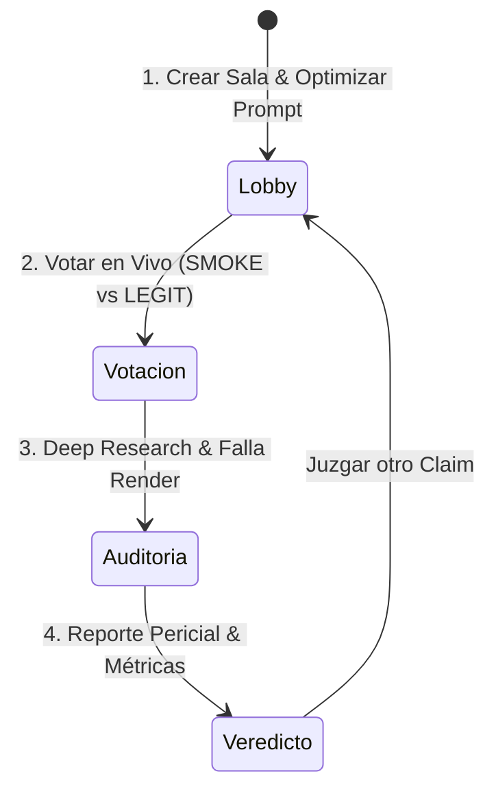

# 🖥️ 03. Guía de Interfaz y Significado de Resultados
#ui #ux #metricas #veredicto #hype-o-meter

Regresar al [[00_INDICE_TRUTH_TRIBUNAL|Índice Maestro]].

---

## 🧭 ¿Qué está viendo el usuario en cada etapa?

La aplicación cuenta con una navegación guiada en 4 etapas reactivas. A continuación se explica el significado de cada elemento visual:



---

## 🏛️ Vista 1: Sala de Espera y Creador de Prompts (`RoomLobby.tsx`)

| Elemento Visual | ¿Qué es? | Significado / Uso |
|---|---|---|
| **Título de la Sala** | Campo de texto | Nombre de la sesión para identificarla (ej: *"Juicio al Hype de IA #1"*). |
| **Claim Textarea** | Campo de texto grande | La afirmación exagerada que se someterá a juicio (copiada de Twitter, LinkedIn o pitch deck). |
| **Presets Rápidos** | 3 botones con categorías | Claims precargados de IA, Cripto y Robótica para probar el flujo sin tener que redactar. |
| **✨ Optimizar con Asistente Pericial** | Botón con varita mágica | **Nueva función pericial:** Si la afirmación es vaga, subjetiva o metafísica, invoca a Nebius y a reglas heurísticas para ofrecer 3 versiones empíricas y verificables con su score de verificabilidad. |
| **Unirse con Código** | Formulario lateral | Permite a cualquier invitado ingresar con el código (ej: `HYPE-404`) para sincronizarse al instante con el Host. |

---

## 🗳️ Vista 2: Votación Multijugador y Hype-o-Meter (`LiveVoting.tsx`)

| Elemento Visual | ¿Qué es? | Significado Pericial |
|---|---|---|
| **Tarjeta del Claim Central** | Cuadro destacado | Muestra el texto exacto bajo investigación, el autor y la categoría. |
| **Botón SMOKE (Fuego)** | Botón rojo con icono de fuego | El votante juzga que la afirmación es **puro humo, engaño o marketing inflado**. |
| **Botón LEGIT (Escudo)** | Botón verde con escudo | El votante considera que la afirmación es **legítima, verídica y defendible**. |
| **Hype-o-Meter (0 - 100%)** | Termómetro animado central | Mide la temperatura de escepticismo de la audiencia humana: `0%` = Todos creen que es real; `100%` = Todos creen que es humo. |
| **Barra de Progreso Colectiva** | Barras porcentuales | Muestra en tiempo real qué porcentaje votó cada opción y el total de votos emitidos. |
| **Botón Desplegar Auditoría** | Botón púrpura (solo Host) | Cierra la etapa de especulación humana y envía el caso al escuadrón autónomo de agentes (Linkup + Nebius + Render). |

---

## 🔬 Vista 3: Deep Research y Tablero de Evidencias (`EvidenceBoard.tsx`)

Durante la investigación, la pantalla se divide en dos componentes: el monitor de progreso del worker de Render y el tablero de hallazgos de Linkup.

### Tarjetas de Evidencias de Linkup:
Cada tarjeta representa una fuente web encontrada y analizada:
1. **Insignia de Procedencia:**
   * `Verde (Real · Linkup)`: La fuente fue obtenida en vivo desde la web vía Linkup Deep Research.
   * `Amarillo (Demo)`: Dato de demostración cuando no hay conexión a internet o cuota de API (para que la demo nunca se congele).
2. **Fase de Investigación:**
   * `Fase 1 (Búsqueda Inicial)`: Hallazgos primarios de hechos y benchmarks.
   * `Fase 2 (Búsqueda de Contraste)`: Derivada de las brechas de la Fase 1 buscando refutaciones o límites técnicos.
3. **Nivel de Incertidumbre (`Uncertainty Level`):**
   * `LOW (Baja)`: Fuente primaria con datos directos, benchmarks o documentación oficial.
   * `MEDIUM (Media)`: Artículos secundarios o reportes de prensa tecnológica.
   * `HIGH (Alta)`: Opiniones en redes sociales, comentarios sin atribución o fuentes no evaluadas aún.
4. **Relación con la Afirmación:**
   * `Respalda el claim`: La fuente aporta evidencia a favor.
   * `Contradice el claim`: La fuente aporta datos que desmienten la afirmación.
   * `Pendiente de evaluar`: La fuente fue recopilada pero aún no ha sido contrastada con citas literales por el LLM.

---

## ⚖️ Vista 4: Veredicto Final y Métricas Cuantitativas (`VerdictReport.tsx`)

Al finalizar la auditoría, suena el audio de veredicto y se despliega el fallo:

### Los 4 Posibles Veredictos:
1. **`CERTIFIED SMOKE` (Puro Humo - Rojo):**  
   Se comprobó que la afirmación es falsa, no reproducible o matemáticamente imposible (Hype > 75%).
2. **`PLAUSIBLE` (Plausible con Reservas - Ámbar):**  
   La tecnología existe, pero con condiciones limitantes severas no mencionadas en el marketing (Hype 40-75%).
3. **`VERIFIED LEGIT` (Verificado Legítimo - Verde):**  
   Existen benchmarks o fuentes primarias que confirman la afirmación en su totalidad (Hype < 40%).
4. **`INSUFFICIENT EVIDENCE` (Evidencia Insuficiente - Ámbar Neutro):**  
   La búsqueda no arrojó fuentes concluyentes o la afirmación es metafísica/fuera de alcance. **Muestra proactivamente cómo reformular el claim con el Asistente Pericial**.

### Las 4 Métricas Cuantitativas en Vivo (Reto Nebius):
```
┌─────────────────┬─────────────────┬─────────────────┬─────────────────┐
│ LATENCIA NEBIUS │   TOKENS E/S    │  COSTO ESTIMADO │    CONFIANZA    │
│    1,240 ms     │   3,792 / 894   │   $0.00025 USD  │       88%       │
└─────────────────┴─────────────────┴─────────────────┴─────────────────┘
```
* **Latencia Nebius:** Tiempo neto exclusivo (en milisegundos) que tardó la llamada HTTP a Nebius Token Factory. Si no hubo llamada al modelo, muestra honestamente `No disponible`.
* **Tokens E/S:** Número exacto de tokens de entrada (*prompt*) y salida (*completion*) reportados por el objeto `usage` del modelo.
* **Costo Estimado:** Cálculo en dólares USD derivado de las tarifas oficiales por millón de tokens en Nebius.
* **Confianza:** Porcentaje de certidumbre pericial basado en la calidad y concordancia de las fuentes primarias.

### Caso Límite del Modelo (*Edge Case Warning*):
Una sección obligatoria exigida por el patrocinador Nebius donde se documenta explícitamente **dónde falla o puede equivocarse el LLM** (por ejemplo: el modelo solo puede analizar fragmentos de texto web; no ejecuta código ni audita repositorios privados).

### Bloque Pro / RevenueCat Paywall:
Muestra la tarjeta de suscripción sandbox `$0.00`. Al desbloquearse con el Test Store, revela la **Matriz de Riesgo para Fondos VC** (riesgo de litigio, recomendación de inversión) y permite exportar el informe ejecutivo en Markdown (`.md`).

---

> [!TIP]
> **Siguiente Lectura Recomendada:**  
> Profundiza en el momento de la auditoría leyendo [[04_DEEP_SEARCH_Y_BOTON_FALLA_RENDER|04. Deep Search y Botón de Falla Render]].
