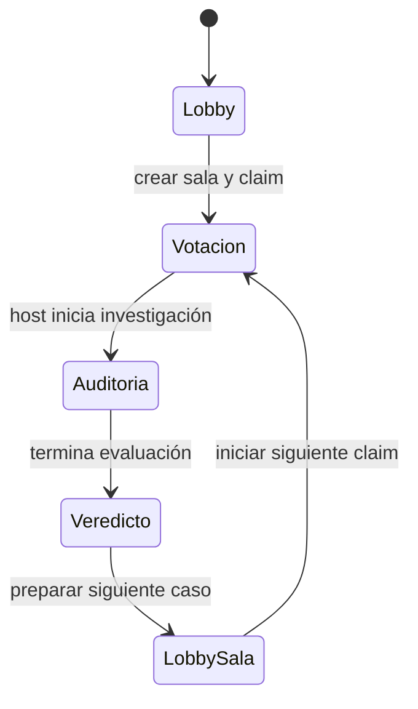

---
tags:
  - interfaz
  - metricas
  - ux
  - veredicto
updated: 2026-09-12
---

# 03 · Interfaz Y Significado De Resultados

Volver a [[00_INDICE_TRUTH_TRIBUNAL|Índice]].

## Etapas Del Caso

## Lobby

| Elemento | Qué significa |
|---|---|
| Título opcional | Identifica la sesión, no modifica el claim. |
| Claim | Afirmación exacta que se intentará comprobar. |
| Ejemplos | Permiten ensayar el flujo rápidamente. |
| Asistente pericial | Propone formulaciones más falsables; no investiga todavía. |
| Código `HYPE-XXX` | Identificador compartible y normalizado de la sala. |
| Selector ES/EN | Cambia la interfaz y persiste la preferencia local. |

## Votación

| Elemento | Lectura correcta |
|---|---|
| **SMOKE** | Opinión humana de que la promesa contiene humo o exageración. |
| **LEGIT** | Opinión humana de que parece defendible. |
| Hype-o-Meter | Porcentaje de votos SMOKE; no es el resultado de la IA. |
| Total de votos | Participación registrada para ese claim. |
| Feed de jurados | Actividad compartida, vinculada a apodos. |

> [!IMPORTANT]
> El Hype-o-Meter del jurado y el hype score del resultado son señales distintas. Uno resume votos; el otro proviene de la evaluación de evidencias.

## Investigación Y Evidencias

Cada tarjeta debe responder:

1. **¿De dónde vino?** Linkup real, replay, fallback/demo o procedencia desconocida.
2. **¿En qué fase apareció?** Inicial o contraste.
3. **¿Qué dice?** Fragmento recuperado y URL de origen.
4. **¿Cómo se relaciona?** Respalda, contradice o permanece pendiente.
5. **¿Qué tan incierta es?** `LOW`, `MEDIUM` o `HIGH`, según la clasificación disponible.

Una URL por sí sola no demuestra una afirmación. Para marcar respaldo o contradicción, la evaluación debe aportar una cita literal validada dentro del fragmento.

## Veredictos

| Resultado | Lectura correcta |
|---|---|
| `CERTIFIED_SMOKE` | Las evidencias válidas contradicen materialmente la promesa o exponen exageraciones decisivas. |
| `PLAUSIBLE` | Hay sustento parcial, pero también condiciones o reservas relevantes. |
| `VERIFIED_LEGIT` | Las evidencias válidas sostienen la afirmación dentro del alcance consultado. |
| `INSUFFICIENT_EVIDENCE` | No existe soporte trazable suficiente para decidir; no equivale a falso. |

Evitar presentar estos resultados como certificación jurídica o verdad universal. Son una evaluación del claim frente a las fuentes recuperadas.

## Métricas Nebius

| Métrica | Origen | Qué puedo afirmar |
|---|---|---|
| Latencia | Tiempo de la petición de inferencia. | Cuánto tardó esa llamada registrada. |
| Tokens E/S | Campo `usage` de la respuesta. | Volumen de entrada y salida reportado por el proveedor. |
| Costo | Requiere tarifa/versionado verificables. | Si no existe cálculo sustentado, “No disponible”. |
| Confianza | Requiere una definición y calibración explícitas. | Si no existe medición, “No disponible”. |
| Caso límite | Texto que describe alcance y posibles fallos. | Qué no pudo comprobar el modelo en ese caso. |

## Pro Y Dossier

- Free conserva el resultado principal y fuentes visibles.
- Pro amplía investigación global y habilita matriz de riesgo y dossier.
- El dossier usa datos del claim, evidencia y resultado; no es asesoría legal ni financiera.
- El PDF se obtiene mediante impresión vectorial del navegador.
- Markdown facilita importación en Obsidian y otras herramientas.
- El acceso sólo es válido cuando el backend confirma el entitlement activo.

## Señales De Demo

- Un badge de fallback significa continuidad, no verificación.
- “Sandbox” significa compra de prueba sin cobro real.
- “Recuperado” sólo demuestra Render si corresponde a un workflow real con logs.
- Una cifra visible debe tener origen; si no, es mejor mostrar “No disponible”.

Siguiente: [[04_DEEP_SEARCH_Y_BOTON_FALLA_RENDER|Deep Search y falla controlada]].
