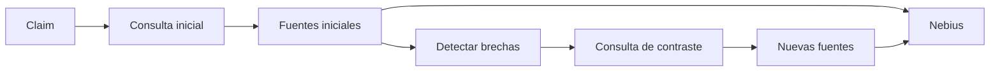
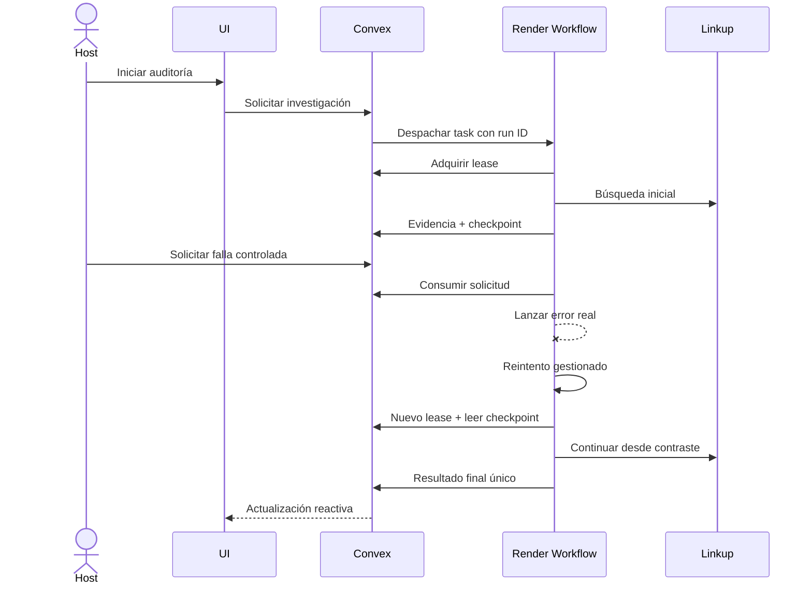

---
tags:
  - deep-research
  - render
  - workflows
  - idempotencia
updated: 2026-09-12
---

# 04 · Deep Search Y Falla Controlada

Volver a [[00_INDICE_TRUTH_TRIBUNAL|Índice]].

## Dos Problemas Diferentes

- **Deep Search:** encontrar y contrastar evidencia relevante.
- **Workflow resiliente:** terminar ese trabajo aunque el proceso falle o el navegador se cierre.

Linkup resuelve búsqueda. Convex guarda la verdad. Render debe ejecutar y reintentar el trabajo desacoplado.

## Investigación En Dos Fases

La segunda consulta debe depender de la primera. `buildContrastPlan` analiza cobertura, incluye términos faltantes y excluye dominios ya visitados. Esto es más defendible que ejecutar dos búsquedas genéricas idénticas.

## Por Qué Existe La Falla Controlada

Un proceso puede caer después de pagar una búsqueda o antes de guardar su resultado. Reintentar todo desde cero puede duplicar filas, consumir cuota y terminar con dos veredictos competidores.

El botón solicita una falla intencional para demostrar que:

1. El worker falla realmente.
2. Render inicia un reintento.
3. El nuevo intento adquiere un lease válido.
4. Lee checkpoints persistidos.
5. Continúa desde la etapa correcta.
6. Convex deduplica efectos repetidos.
7. Sólo una ejecución puede cerrar el caso.

## Conceptos Que Debo Poder Explicar

### Checkpoint

Marca persistida de una etapa terminada. Sobrevive al proceso porque vive en Convex, no en memoria del worker.

### Idempotencia

Repetir una operación produce el mismo efecto final. En este proyecto implica reutilizar la investigación y evitar evidencia duplicada por investigación/URL normalizada.

### Lease

Permiso temporal para que un intento modifique la investigación. Evita que dos workers activos escriban progreso simultáneamente.

### Callback Obsoleto

Respuesta de un intento anterior cuyo lease ya no es válido. El backend debe rechazarla aunque llegue tarde.

### Falla Consumible Una Vez

La solicitud se consume al lanzar la excepción. Así el reintento siguiente puede continuar en vez de fallar para siempre.

## Flujo Objetivo

## Estado Actual

**Implementado y probado con automatización:** SDK de Workflows, despacho, secretos compartidos, leases, checkpoints, reintentos, deduplicación y rechazo de callbacks desfasados.

**No verificado todavía:** una ejecución dentro de Render con run ID y logs reales. El alta del servicio quedó bloqueada por el paso Add Card. El manifiesto `workflows/render.yaml` por sí solo no demuestra Render Workflows.

## Evidencia Necesaria Para Cerrar Render

- ID del run real.
- Log del primer intento fallando.
- Log del reintento.
- Mismo caso/investigación en ambos intentos.
- Checkpoint inicial conservado.
- Conteo de evidencias sin duplicados.
- Un único resultado final.
- La UI continúa aunque se cierre el navegador del host.

## Cómo Grabarlo

Sólo después de completar la ejecución real:

1. Iniciar auditoría.
2. Esperar a que exista un checkpoint persistido.
3. Pulsar “Inducir falla controlada”.
4. Mostrar brevemente error y número de reintento.
5. Mostrar recuperación y avance.
6. Añadir un overlay con run ID y “0 duplicados”.

Si Render sigue pendiente, no pulsar el botón como si fuera evidencia. Dedicar ese segmento a Linkup/Nebius y declarar la integración de workflow como pendiente.

Siguiente: [[05_NEBIUS_TOKEN_FACTORY_EN_DETALLE|Nebius Token Factory]].
