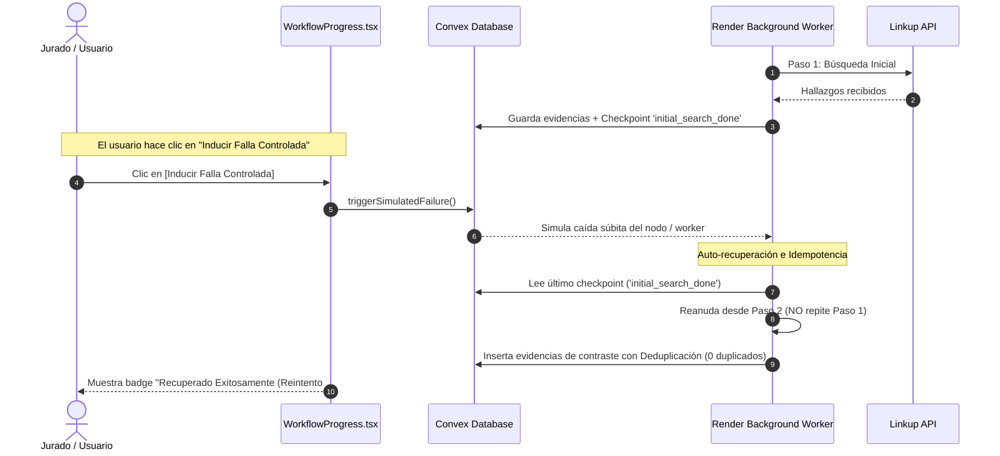

# ⚡ 04. El Deep Search y el Botón de Falla Controlada (Reto Render)
#render #workflows #idempotencia #resiliencia #deep-research

Regresar al [[00_INDICE_TRUTH_TRIBUNAL|Índice Maestro]].

---

## 🧭 ¿Qué es ese Botón durante el Deep Search?

Cuando el Host pulsa *"Desplegar Auditoría Autónoma"*, la pantalla entra en la fase de investigación profunda. En la parte inferior del monitor de progreso aparece una tarjeta con el botón:

```
[ 🔄 Inducir Falla Controlada ]
```



---

## 🎯 ¿Por qué existe este botón y cuál es su objetivo?

Este botón fue creado específicamente para **cumplir con la demostración en vivo del Reto Render Workflows ($900 en créditos)**:

> **El problema en sistemas distribuidos:**  
> Cuando un worker en segundo plano ejecuta tareas pesadas (consultas web, scraping, inferencia con LLMs), un servidor puede reiniciarse por falta de memoria (OOM), pérdida de red o rotación de instancias.  
> Si el sistema no está bien diseñado:
> 1. El proceso se rompe y deja la pantalla colgada para siempre.
> 2. O el sistema reintenta desde cero, duplicando evidencias en la base de datos y gastando el doble de dinero en llamadas a las APIs.

### Lo que demuestra este botón ante los jueces:
1. **Tolerancia a fallos:** El sistema no se congela; detecta la caída.
2. **Checkpoints persistentes:** Convex almacena qué pasos ya terminaron (`completedCheckpoints: ["linkup_initial_search_done"]`).
3. **Idempotencia estricta:** Al reanudar, la mutación `add` en [`convex/evidence.ts`](file:///c:/Users/Santiago%20Arenas/Desktop/Burning%20dev/convex/evidence.ts) comprueba si la URL ya existe:
   ```typescript
   // Deduplicación en base de datos
   const existing = await ctx.db
     .query("evidence")
     .withIndex("by_investigation", (q) => q.eq("investigationId", args.investigationId))
     .filter((q) => q.eq(q.field("url"), args.url))
     .first();
   if (existing) return existing._id; // ¡Cero duplicados!
   ```
4. **Cero desperdicio de cuota:** No vuelve a llamar a la Fase 1 de Linkup; pasa directamente a la Fase 2 o a Nebius.

---

## 🎬 Cómo usar este botón en el Video Demo de 2 Minutos

En el guion del video para el jurado (entre el segundo `0:50` y el `1:15`):

1. Pulsa *"Desplegar Auditoría Autónoma"*.
2. Cuando veas la barra de progreso avanzando por *"Búsqueda Inicial"* (40-65%), haz clic en **`[Inducir Falla Controlada]`**.
3. Escucharás una alerta sonora de sirena.
4. Señala a la cámara cómo:
   * El contador de reintentos sube a `Reintentos Idempotentes: 1`.
   * El botón cambia a color ámbar: `Recuperado Exitosamente (Reintento #1)`.
   * Aparece el badge verde: `✓ Checkpoint restaurado · Cero duplicados en BD`.
   * La auditoría continúa su curso con normalidad hasta emitir el veredicto final.

---

## 🛡️ Estructura del Manifiesto de Render (`workflows/render.yaml`)

Para la arquitectura en la nube de Render, el proyecto cuenta con el manifiesto declarativo:
```yaml
services:
  - type: worker
    name: truth-tribunal-auditor-worker
    runtime: node
    plan: starter
    buildCommand: npm install
    startCommand: node workflows/auditor_workflow.ts
    envVars:
      - key: CONVEX_URL
        fromService:
          type: web
          name: truth-tribunal-web
          property: host
```

Esto demuestra que los procesos intensivos de scraping e investigación están desacoplados del renderizado web de los usuarios.

---

> [!TIP]
> **Siguiente Lectura Recomendada:**  
> Aprende los secretos de la inferencia con LLM en [[05_NEBIUS_TOKEN_FACTORY_EN_DETALLE|05. Inferencia con Nebius Token Factory]].
