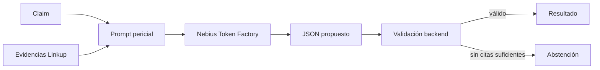

---
tags:
  - nebius
  - llm
  - evidencia
  - trazabilidad
updated: 2026-09-12
---

# 05 · Nebius Token Factory En Detalle

Volver a [[00_INDICE_TRUTH_TRIBUNAL|Índice]].

## Rol En El Producto

Nebius no busca las páginas. Recibe el claim y los fragmentos obtenidos por Linkup para producir una evaluación estructurada. Su trabajo es relacionar evidencia, no crear hechos nuevos.

## Modelo Y Contrato

- Modelo por defecto: `Qwen/Qwen3-30B-A3B-Instruct-2507`.
- Variable configurable: `NEBIUS_MODEL`.
- API: compatible con OpenAI Chat Completions.
- Salida esperada: JSON con veredicto, hype score, resumen, evaluaciones por fuente y caso límite.

La disponibilidad de modelos puede cambiar. Por eso el modelo no debe estar asumido como una constante eterna y los errores se registran de manera explícita.

## Barrera Contra Citas Inventadas

Para clasificar una fuente como respaldo o contradicción:

1. El modelo devuelve el ID de la evidencia.
2. Incluye una cita literal y una explicación.
3. El backend normaliza texto y compara la cita con el fragmento real.
4. Si no coincide, la relación se descarta o queda pendiente.
5. Si no quedan relaciones suficientes, la política se abstiene.

Esto reduce un tipo concreto de alucinación. No demuestra que el fragmento sea verdadero, completo, reciente o representativo.

## Política De Abstención

`INSUFFICIENT_EVIDENCE` se utiliza cuando:

- faltan fuentes suficientes;
- Linkup o Nebius fallan;
- la respuesta no cumple el contrato;
- las citas no son trazables;
- el claim está fuera del alcance recuperado.

**Abstenerse no significa que el claim sea falso.** Significa que el sistema no reunió base suficiente para una conclusión defendible.

## Métricas Y Origen

### Latencia

Se mide alrededor de la petición `fetch` a Nebius. Incluye el viaje de esa petición y la inferencia del proveedor; no debe describirse como tiempo puro de GPU ni como duración total de la auditoría.

### Tokens

Se leen de `usage.prompt_tokens` y `usage.completion_tokens`. Si el proveedor no devuelve `usage`, la UI muestra “No disponible”.

### Costo

Requiere una tabla de precios vigente, modelo exacto y fórmula versionada. Actualmente debe permanecer no disponible si esas condiciones no están acreditadas.

### Confianza

Una probabilidad útil requiere definición, calibración y evaluación. La calidad aparente de las fuentes no basta para afirmar “88 % de confianza”. Actualmente debe permanecer no disponible salvo que se implemente y documente una metodología.

### Caso Límite

Describe una limitación concreta: snippets incompletos, fuentes secundarias, paywalls, ausencia de repositorios privados o imposibilidad de ejecutar un benchmark. Es información para interpretar el resultado, no una métrica de precisión.

## Ejecución Real Registrada

El 08/09 una comprobación real produjo:

- Dos respuestas Linkup HTTP 200.
- Una respuesta Nebius HTTP 200.
- Ocho fuentes recuperadas.
- 3.792 tokens de entrada.
- 894 tokens de salida.
- 18.306 ms de latencia de petición.
- Resultado `INSUFFICIENT_EVIDENCE`.

El reporte está en `docs/verification/research-live-2026-09-08.json`. Esta corrida comprueba integración y una limitación observada; no es un benchmark general de precisión.

## Asistente De Claims

El asistente propone formulaciones empíricas cuando el usuario escribe algo demasiado amplio. Su objetivo es aumentar falsabilidad y mejorar las posibilidades de recuperación. Una sugerencia sigue siendo una propuesta; no se convierte en verdad por venir de un modelo.

## Respuesta Corta Para El Jurado

> “Linkup recupera las fuentes y Nebius las evalúa. Para marcar respaldo o contradicción exigimos una cita literal que el backend valida contra el fragmento original. Si no hay trazabilidad suficiente, el tribunal se abstiene.”

Siguiente: [[06_HOJA_DE_RUTA_MEJORA_ESTETICA|Diseño y evolución visual]].
