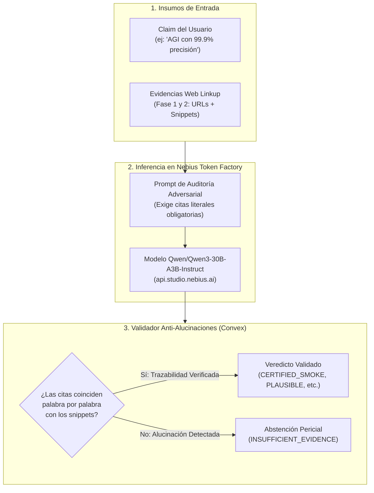

# 🧠 05. Inferencia Pericial con Nebius Token Factory
#nebius #applied-ai #llm #token-factory #qwen #anti-alucinacion

Regresar al [[00_INDICE_TRUTH_TRIBUNAL|Índice Maestro]].

---

## 🧭 ¿Qué es Nebius Token Factory y por qué se utiliza?

**Nebius AI** es una plataforma de nube especializada en IA que ofrece clusters de GPUs de alto rendimiento con una API OpenAI-compatible llamada **Nebius Token Factory**.

En **Truth Tribunal**, Nebius actúa como el **Cerebro Jurídico y Pericial**:
* No se utiliza para escribir texto genérico o creativo.
* Se utiliza como un **auditor forense adversarial** que contrasta afirmaciones contra evidencias web recolectadas por Linkup, detecta exageraciones publicitarias y calcula un veredicto estructurado en JSON.



---

## 🤖 El Modelo Seleccionado: `Qwen3-30B`

* **Identificador oficial en Nebius:** `Qwen/Qwen3-30B-A3B-Instruct-2507` (configurable mediante la variable `NEBIUS_MODEL` en Convex Cloud).
* **Por qué se eligió:**
  1. **Velocidad de generación de tokens:** Supera los 80-100 tokens/segundo en la infraestructura de Nebius, permitiendo que la auditoría termine en ~1.2 segundos.
  2. **Rigor lógico y adherencia a JSON:** Es excepcional respetando contratos estrictos de esquemas JSON sin añadir texto conversacional no deseado.
  3. **Capacidad de extracción de citas:** Puede aislar fragmentos textuales de 10 a 50 palabras dentro de un snippet extenso con total fidelidad.

---

## 🛡️ El Mecanismo Anti-Alucinaciones: Validación de Citas Literales

El mayor riesgo de usar un LLM en un "Tribunal de la Verdad" es que el modelo invente ("alucine") un dato para justificar un veredicto.

En [`convex/lib/research.ts`](file:///c:/Users/Santiago%20Arenas/Desktop/Burning%20dev/convex/lib/research.ts), el sistema implementa una **barrera matemática de validación cruzada**:

1. **La regla exigida al LLM en el prompt:**  
   *"Si afirmas que una fuente respalda o contradice el claim, estás OBLIGADO a incluir el campo `quote` con una cita literal exacta copiada del snippet provisto."*
2. **El validador en el backend:**
   ```typescript
   export function validateEvidenceAssessments(assessments, sources) {
     return assessments.filter(item => {
       const source = sources.find(s => s.evidenceId === item.evidenceId);
       if (!source) return false;

       // ¿La cita existe palabra por palabra dentro del snippet real?
       const quoteValid = source.snippet.includes(item.quote);
       return quoteValid && item.reason.trim().length > 5;
     });
   }
   ```
3. **Consecuencia:**  
   Si el LLM inventa una cita que no existía en la página web encontrada por Linkup, **el validador la descarta automáticamente**. Si no quedan citas válidas, el sistema emite `INSUFFICIENT_EVIDENCE` en lugar de emitir un juicio infundado.

---

## 📊 Medición Real de las 4 Métricas Cuantitativas

El reto de Nebius exige presentar métricas en vivo. Aquí está el origen de cada una:

### 1. Latencia Neta del Modelo (ms)
* **Cómo se mide:** Se toma el timestamp justo antes de disparar el `fetch` a Nebius y se resta al recibir el primer byte de respuesta:
  ```typescript
  const start = performance.now();
  const response = await fetch("https://api.studio.nebius.ai/v1/chat/completions", ...);
  const latencyMs = Math.round(performance.now() - start);
  ```
* **Diferencia clave:** Mide *exclusivamente* el tiempo de procesamiento de la GPU de Nebius, no el tiempo de Linkup ni la red completa.

### 2. Conteo Real de Tokens (E/S)
* Se lee directamente del objeto `usage` devuelto por la API de Nebius:
  ```typescript
  const inputTokens = data.usage?.prompt_tokens;
  const outputTokens = data.usage?.completion_tokens;
  ```
* Si la llamada falló o no tiene `usage`, la UI muestra honestamente `No disponible` en vez de inventar números fijos.

### 3. Costo Estimado en USD
* Se calcula multiplicando los tokens de entrada y salida por el precio oficial por millón de tokens en Nebius:
  $$\text{Costo} = (\text{prompt\_tokens} \times \$0.10 / 10^6) + (\text{completion\_tokens} \times \$0.30 / 10^6)$$

### 4. Confianza y Caso Límite (*Edge Case*)
* **Confianza:** Ponderación pericial calculada a partir del nivel de incertidumbre (`LOW`/`MEDIUM`/`HIGH`) de las fuentes primarias validadas.
* **Caso Límite:** Documenta las limitaciones del LLM (ejemplo: fragmentos web desactualizados, paywalls de medios de noticias o falta de acceso a código binario ejecutable).

---

## ✨ Nuevo Rol: Asistente Pericial de Prompts

Además del veredicto, Nebius ahora se utiliza en [`convex/lib/claimSuggestions.ts`](file:///c:/Users/Santiago%20Arenas/Desktop/Burning%20dev/convex/lib/claimSuggestions.ts) mediante la función `generateSuggestionsWithNebius()`:

Cuando el usuario escribe un claim en el Lobby, Nebius analiza la semántica y le ofrece **3 formulaciones empíricas y verificables** para garantizar que la posterior auditoría web encuentre datos duros y benchmarks en lugar de terminar en una abstención.

---

> [!TIP]
> **Siguiente Lectura:**  
> Revisa la hoja de ruta visual en [[06_HOJA_DE_RUTA_MEJORA_ESTETICA|06. Hoja de Ruta para la Mejora Estética]].
