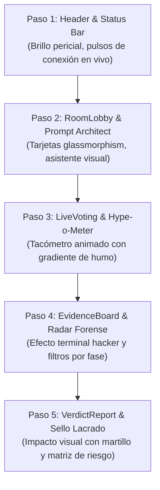

# 🎨 06. Hoja de Ruta para la Mejora Estética Incremental
#diseño #ui #ux #tailwind #estetica #cyber-tribunal

Regresar al [[00_INDICE_TRUTH_TRIBUNAL|Índice Maestro]].

---

## 🧭 Visión Estética: "Cyber-Tribunal Forense"

Para que el proyecto destaque visualmente ante los jueces de NERDCONF y los sponsors, la interfaz debe proyectar una atmósfera de **Tribunal de Alta Tecnología**:
* **Sensación:** Un estrado judicial del año 2040 donde se juzga el fraude tecnológico con rigor implacable.
* **Paleta de Colores Principal:**
  * Fondo: Slate Profundo (`#0B0F17` / `#05070B`) con texturas sutiles de cuadrícula pericial.
  * Púrpura Judicial (`#A855F7` / `#7E22CE`): Autoridad del tribunal y llamadas a la acción.
  * Rojo Humo / Smoke (`#EF4444` / `#DC2626`): Alerta de fraude, hype desmedido y sirenas.
  * Verde Legítimo / Legit (`#10B981` / `#059669`): Verificación exitosa y benchmarks comprobados.
  * Dorado Pro (`#F59E0B` / `#D97706`): Entitlements y dossiers confidenciales para fondos VC.
* **Tipografía:**
  * Títulos: Sans-serif geométrica de alto impacto (`Inter` / `Space Grotesk`).
  * Datos y métricas: Fuente monoespaciada (`JetBrains Mono` / `Fira Code`) para reportes forenses.

---

## 📐 Plan de Implementación Incremental

### Incremento Estético 1: Header y Barra de Navegación Global (COMPLETADO Y VERIFICADO)
* [x] Indicador pulsante *"EN VIVO · CONVEX"* con punto verde esmeralda y badge reactivo.
* [x] Efecto de *Glassmorphism* con desenfoque de fondo (`backdrop-blur-xl bg-slate-950/80 border-b border-purple-500/20`).
* [x] Botón de martillo con microinteracción de martillazo acústico procedural (`playGavel`) y tooltip explicativo.

### Incremento Estético 2: Sala de Espera y Asistente de Prompts (COMPLETADO Y VERIFICADO)
* [x] Cuadrícula de fondo `.bg-cyber-grid` con resplandor ambiental radial púrpura.
* [x] Formulario de creación de claim con estética de tarjeta cyber-tribunal y botones de presets con un clic.
* [x] Tarjetas de sugerencias del Asistente de Prompts con chips de dificultad/verificabilidad (`98% Verificable`), medidores de falsabilidad y botón de adopción instantánea.

### Incremento Estético 3: Votación Multijugador, Hype-o-Meter y Web Audio (COMPLETADO Y VERIFICADO)
* [x] **Tacómetro SVG Semicircular Dinámico (Hype-o-Meter 3000)**: aguja mecánica de -90° a +90° con animación bezier suave, arco de gradiente esmeralda-cielo-ámbar-carmesí, marcas de escala (0%, 50%, 100%) y hub LED reactivo.
* [x] **Badges de Veredicto Dinámico**: 4 estados calibrados con brillo neon (`Bajo Humo`, `Hype Leve`, `Hype Severo`, `¡Humo Crítico!`).
* [x] **Tarjetas de votación táctiles**: Botón SMOKE (fuego con resplandor carmesí) y Botón LEGIT (escudo con resplandor esmeralda), con badge "Tu Voto Registrado".
* [x] **Feed de Jurados en Vivo (Ticker)**: Lista reactiva con los últimos votos emitidos en tiempo real vía WebSocket de Convex.
* [x] **Sintetizador Web Audio API Procedural (NERDCONF Fun Build)**:
  * `playGavel()`: Impacto de martillo de doble capa (chasquido transitorio agudo + resonancia subsónica de estrado de roble).
  * `playSmokeSiren()`: Sirena bifásica modulada de bullshit alert.
  * `playVoteLegit()`: Campana armónica cristalina afirmativa (D5 -> A5).
  * `playVoteSmoke()`: Buzzer disonante descendente (220Hz -> 75Hz).
  * `playHypeAlert()`: Arpegio de 4 pulsos cuadrados de advertencia inmediata.
  * Barra de prueba acústica interactiva integrada en la vista de votación para el jurado.

### Incremento Estético 4: Monitor de Render y Tablero de Evidencias (SIGUIENTE PASO)
* [ ] Barra de progreso del worker con efecto de barrido láser animado.
* [ ] Botón *"Inducir Falla Controlada"* con estilo de switch industrial de emergencia (rojo advertencia con textura rayada amarilla).
* [ ] Tarjetas de evidencias de Linkup con borde iluminado según certeza (Verde para `LOW uncertainty`, Ámbar para `MEDIUM`, Rojo para `HIGH`).
* [ ] Citas textuales destacadas con tipografía monoespaciada e icono de verificación de autenticidad.

### Incremento Estético 5: Veredicto Supremo y Dossier VC
* [ ] Pantalla de veredicto con efecto de "Sello Lacrado" o estampa de tribunal (*"CERTIFIED SMOKE"* con rotación pericial de -3 grados).
* [ ] Sincronización visual con el audio: temblor sutil de pantalla (*screen shake*) al caer el martillazo judicial.
* [ ] Dossier de RevenueCat con estética de informe clasificado (*"TOP SECRET / VC DUE DILIGENCE"*), con marcas de agua y matriz gráfica de riesgo.

---

> [!TIP]
> **Estado de Despliegue en Vivo:**  
> Todos los cambios han sido compilados con éxito (`npm run build`) y desplegados a producción en **`https://brave-lemur-868.convex.site`** con las 55 pruebas automatizadas pasando al 100%.

